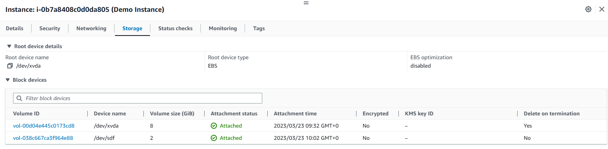

# EC2 - Elastic Compute Cloud
In AWS EC2 allows users to create virtual servers

## Creating an EC2 Instance
An _EC2 Instance_ is a virtual machine that we can create in the cloud, the setup of an EC2 instance covers several components.

To start off we can launch a brand new EC2 instance from the EC2 Dashboard by clicking on _Launch Instance_, alternatively we can navigate to the _Instances_ window (see menu on left-hand side) and launch an instance from there.

We are then taken to the page below where we set up our instance.

On the right-hand side we are given a brief summary of our instance including the number of instances we wish to launch, what AMI we are using, instance type, security group and storage. 

### AMI (OS)
A preconfigured template for your instances, known as _Amazon Machine Images_, that package your server requirements (including the operating system and additional software). Amazon provides several of these already but we can create our own AMIs based off of instances we have configured.

### Instance Types
Instance types comprise varying combinations of CPU, memory, storage, and networking capacity. Each instance type includes one or more instance sizes, allowing you to scale your resources to the requirements of your target workload. We typically use _t2.micro_ but depending on what you wish to run in your instance you may wish to opt for a larger size.

### Key pair
You may want to connect to your instance to custmise it. If so, you will need a key pair (which you are able to generate in AWS - if you are creating a new key pair choose an RSA key then save the generated .pem file in a safe location) in order to securely access your instance.

### Setting Security Groups
A Security Group is a firewall that we attach to an EC2 instance, this controls the traffic heading in and out of our instance. We can use an existing security group or we can create a new security group for our instance.

_Note with security groups, if connecting to an instance fails due to a timeout, this implies a security group issue._

### Classic Ports to know
- 22 = SSH (Secure Shell) - log into a Linux instance
- 21 = FTP (File Transfer Protocol) - upload files into a file share
- 22 = SFTP (Secure File Transfer Protocol) -  upload files using SSH
- 80 = HTTP - access unsecured websites
- 443 = HTTPS - access secured websites
- 3389 = RDP (Remote Desktop Protocol) - log into a Windows instance

Once we are happy with our set up we can click _Launch Instance_. We can now see our instance running in the _Instances_ page of the AWS console.

## Connecting to our EC2 Instance
Now that our instance is up and running we can connect to it, just click on *Connect* as we can see in the previous image and we will be taken to the page below.

AWS offers several options to connect to our instance but for this demo we'll connect via SSH client, for this you will have had to create or assigned a key pair to the instance, otherwise connecting this way won't be possible. Follow the instructions as shown above and execute the example command in your terminal (make sure that you are doing so from the same directory as your key pair or else you will be denied access). Once we are in, we can begin customising our EC2 instance with our desired software and configurations.

### User Data
This feature allows us to bootstrap our instance, meaning that we provide a script to be executed inside our instance when its launched for the first time (Note to start the script off with `#!/bin/bash`). Here's a demonsration launching an instance with a user data script to launch an Nginx Server. We can find _User data_ in *Advanced Settings* at the bottom of the EC2 instance set up page, we are able to enter our script right at the bottom of the page.

We can then launch our instance as we did before, but note it may take a little while longer to start running due to us having the instance bootstrapped to run a script upon launch.

Once our instance is running we can check that our user data script was successful by copying the public IPv4 address (or clicking _open address_)

And here is our working Nginx server from our bootstrapped instance!

### EC2 Instance Role
This allows us to link an EC2 instance to an IAM role, allowing us to interact with the AWS console via `awscli` (provided that the role has the permissions to do so).

## Elastic Block Store (EBS) Volume
These volumes are network drives (i.e. not physical) that we can attach to our running EC2 Instances, allowing them to persist data, even beyond termination. We can think of these as USB Sticks for our intsances. These will be created with our instances but we can create them ourselves and attach them to our instances. We can attach multiple volumes to our instances. Note that volumes are bound by availability zones, thus we cannot attach to instances outside an EBS Volume's AZ. 

We can view and manage our volumes by clicking on "Volumes" in the "Elastic Block Store" dropdown on the left-hand side of the AWS console

The volume in the snippet above is an example of a root volume, created along with our instance, these are also set to be terminated along with our instance should the attached instance be terminated. Of course we can create volumes without having to create an instance by clicking on _Create volume_ (top right corner of the snippet).

Once we are happy with our specifications we create our volume and we are then able to attach that volume to an instance. We can attach any **Available** volume to an instance by clicking _Actions_ and _Attach volume_ as shown below. Remember we can only attach a volume to a single instance at a time, whereas we can attach multiple volumes to a single EC2 instance.

Next we simply specify what instance we want our volume to be attached to. Remember that volumes are bound by AZs, therefore a volume created in eu-west-1a cannot be attached to an EC2 instance in eu-west-1b, thus in the page shown in the snippet below,you will only be shown instances from the same AZ as the volume.

And now we can see two volumes attached to our instance, the root volume created with our instance and the one we created seperately.

Note that the root volume will be deleted if the attached instance is terminated, but the other volume will remain. If you have no further use for that particular volume then you will need to manually delete that volume (a volume needs to be detached before it can be deleted) which can be done in the _Volumes_ page.

Note that a way around the AZ restriction placed on EBS volumes is by creating snapshots of those volumes. These snapshots in turn can be used to create other volumes in other AZs. This is useful if we want to transfer the data we have on one volume in one AZ to another.

We can do this by clicking on the volume we want to make a snapshot of and then click _Actions_ then _Create snapshot_

We can then view our snapshots by navigating to _Snapshots_ under the _Elastic Block Store_ dropdown on the left-hand side of the console.

As you can see we can create a volume directly from this snapshot, so if we want to transfer our data from a volume in eu-west-1a to eu-west-1b we can take a snapshot of the volume in eu-west-1a and then create a volume in eu-west-1b

Now we can attach this volume to an instance in eu-west-1b.

## Amazon Machine Image (AMI)
When we create an instance we need to select an AMI, these can be provided to us by AWS in the form of Public AMIs, but we do have the option in AWS to create our own AMIs that will contain our desired OS, software, configurations etc. We can think of this as creating a template based on a customised EC2 instance.

### Creating our own AMI
In order to do this we will need to have an EC2 running with our desired customisations. Lets say we have installed an Nginx web server on an EC2 instance, suppose we wanted to create another instance that has an Nginx web server running on it, instead of us having to connect to the instance to install Nginx or bootstrapping the instance to run a script on launch, we can create an AMI based off of our first customised instance.

To start off we need to click on _Create image_ as shown above.

Here we name our AMI and make any other desired customisations to. Once we're happy we can scroll down and click on _Create image_.

Once created we can view our AMI in the AMIs page as shown below

From here we can actually directly launch an instance from our AMI by clicking on _Launch instance from AMI_. Alternatively we can go to the _Instances_ page and launch an instance as we would usually, but this time select an AMI you created which will be found under _My AMIs_

Here is our instance launched from our AMI.

And if we copy the public IP and enter in the browser we should have an Nginx server already up and running without us having to connect to the instance to install anything or having written a script in the user data.

## Scalability
Scalability refers to the ability to adapt based on demand. There are two types of scalability.
### Vertical Scalability
This means increasing the size of the instance, i.e. scale up or down, e.g. if our application is running on t2.micro we can vertically scale that application meaning that the instance the application runs on increases to t2.large. Note with vertical scalability there is a limit on how much we can vertically scale, which is the hardware limit.
### Horizontal Scalability
This means increasing the number of instances running for our application, i.e. scale in and out. This is very common for modern applications as many of these are developed with horizontal scalability in mind. It is possible to achieve this in AWS via Auto Scaling Groups and Load Balancers.

## High Availability
High availability in AWS means running your application in at least 2 AZs, this is a measure to counter data centre loss (such as via natural disasters).

## Elasticity
This means once a system is scalable there will be some auto-scaling so that the system can scale based on the load so that it is able to match demand.

## Application Load Balancer (ALB)
We can create a load balancer to direct the traffic among our targeted EC2 instances. This also supports health checks of our EC2 instances.

### Creating our ALB
We start by navigating to _Load Balancers_, which can be found under the _Load Balancing_ dropdown on the left-hand side of the console. Then on the load balancers page click _Create load balancer_. You will then be asked to select a load balancer type, where you are given the following options: _Application Load Balancer_, _Network Load Balancer_, _Gateway Load Balancer_, _Classic Load Balancer_ (will soon no ,longer feature). For the purpose of this demo of course we will select ALB.

We will then be taken to the following page.

If you are still unsure about how Elastic Load Balancing works AWS provides a brief overview for you.

Here is a summary of our configurations for our ALB where we have assigned a custom security group that we created specifically for our load balancer. We have also opted in the _Network mapping_ section to direct traffic to all AZs in _eu-west_1_.

**IMPORTANT NOTE** - A target group must be defined before creating the load balancer. This target group will contain instances that we want our ALB to direct traffic to, so if you haven't done so by this point you should create a couple of instances and add them to a target group. I went back to create a target group called _demo-tg-alb_ and added two instances.

Once we are happy we click _Create load balancer_.

Recall that we created two instances for the target group that was attached to this load balancer. Just to show that the load balancer actually works properly and spreads traffic among the instances, I bootstraped both to install an apache http server to display the message **Hello World from** *hostname*, the hostname can be viewed on your instance details. To test our ALB, we copy the DNS name as shown above and open it in the browser.

The snippet above shows the web server we have running on our first instance, which is great to see that the load balancer does in fact direct traffic to our instance, but lets refresh the page.

Now we can see the web server we have running on our second instance, which shows that our ALB works properly and diverts traffic to all the instances we have in our target group.

## Auto Scaling Group (ASG)
The goal of an ASG is to:
- Scale out (add EC2 instances) to match an increased load
- Scale in (remove EC2 instances) to match a decreased load
- Ensure we have a minumum and a maximum number of machines running
- Automatically register or deregister instances to a load balancer
- Replaces unhealthy instances

ASG and load balancers go hand in hand!