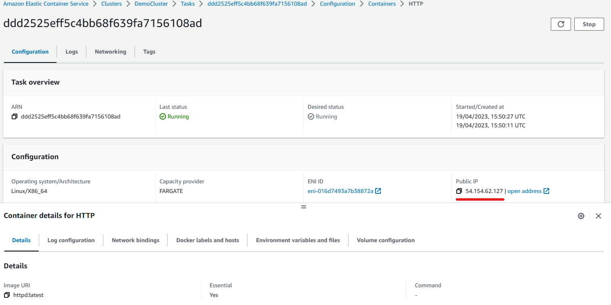

# Elastic Container Service (ECS)
Amazon Elastic Container Service (Amazon ECS) is a fully managed container orchestration service that helps you easily deploy, manage, and scale containerized applications.

## Clusters
A cluster in ECS is a logical grouping of tasks or services. You can use clusters to isolate your applications. This way, they don't use the same underlying infrastructure.

### Creating a Cluster in ECS
To get started with ECS we create a cluster in the ECS console. We can do this by clicking on _Get started_ in the ECS console home, or by clicking on _Clusters_ on the left-hand side of the console. 

We are then taken to the _Clusteers_ page of the console where we can view all of our ECS clusters. To create a cluster click on _Create cluster_, which will take you to the following page.

Note that the _Default namespace_ will automatically change to the name you give the cluster, you can change this if you wish.

If we scroll down we can see that the cluster is automatically configured for AWS Fargate, which is a technology that we can use on ECS to run containers without having to manage servers or clusters of EC2 instances, hence why it is a __serverless__ offering.

Once we are happy with our configurations we click on _Create_ to create our cluster.

## Task definitions
In ECS a task definition is essentially a blueprint for for your application, in it you specify the various parameters of your application. For example, you can use it to specify parameters for the operating system, which containers to use, which ports to open for your application, and what data volumes to use with the containers in the task.

### Creating a Task definition
To create a task definition, click on _Task definitions_ on the left-hand side of your ECS console, there you can view all of your task definitions, to make a new one click on _Create new task definition_.

We are then taken to this page, under _Task definition family_ the name should be an approprate one, for example, __Nginx__ if you are launching an Nginx server. You can then configure you containers, notice it asks for _Image URI_, if you have an image on DockerHub, you should be able to simply provide the _image:tag_ key-value pair, as you can see in the snippet above.

Once we're done with that, click _Next_, we will then be take to step 2 where we can configure environment, storage, etc.

AWS Fargate is selected automatically as our app environment, but we can add EC2 instances if we wish. There are other sepcifications we can change such as OS, although you should select an OS that is compatible with your selected image. Once we are happy with our configurations we can review everything and then create our task definition.

### Deploy a Service or run a Task
When we create our task definition we will be notified imediately that our task definition has been successfully created and that we can deploy a service or run a task. To do this we head back to _Clusters_ in the ECS console and click on a cluster that we have created.

_Task_ : The instantiation of a task definition within a cluster. After you create a task definition for your application within Amazon ECS, you can specify the number of tasks to run on your cluster.

_Service_ : You can use an Amazon ECS service to run and maintain your desired number of tasks simultaneously in an Amazon ECS cluster. How it works is that, if any of your tasks fail or stop for any reason, the Amazon ECS service scheduler launches another instance based on your task definition.

I'll start off by running a task, we can do this by navigating to the cluster we wish to run the task on, or if we have just created a task definition we can click the _Deploy_ dropdown shown at the top of the above snippet, and we will be given the option to run a task. After clicking _Run new task_ we will be taken to the following page.

We can select which custer we want our task to run on, since we only have one (_DemoCluster_) the window has already been completed. We can edit the _Compute configuration if we wish.

If we scroll down we can edit the deployment configuration, here we select the task definition we ceated earlier, in this case mine is _ApacheHTTPd_.

For the purposes of this guide I've left everything else as their default. Once we've created the task we should see the following in our cluster under _Tasks_.

To verify it works, we click on the task we just created to open it up, which should take us to the following page.

Copy the _Public IP_ or click on _open address_, and what we should see is our container image via our browser.

