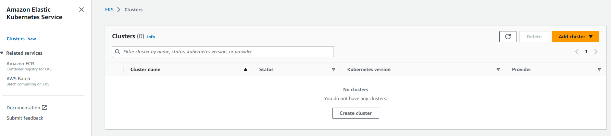
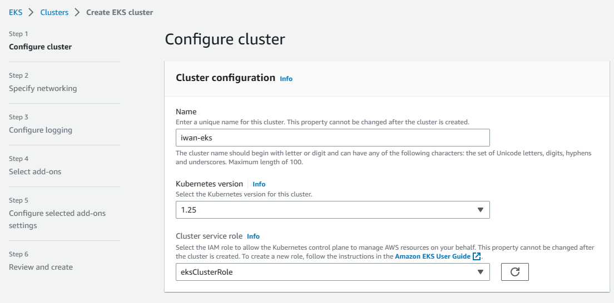
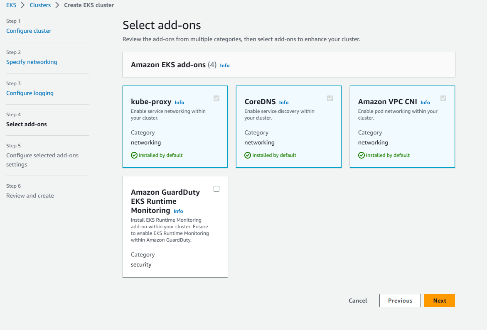
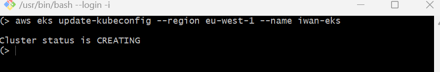
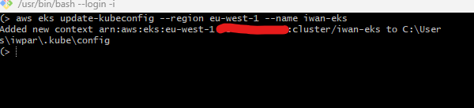
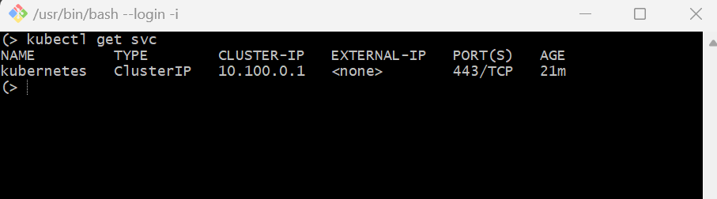

# Amazon Elastic Kubernetes Service (EKS)
Amazon EKS is a fully-managed Kubernetes service that simplifies the process of building, securing, operating, and maintaining Kubernetes clusters on AWS and on-premises data centres. EKS is certified Kubernetes-conformant, so existing applications that run on upstream Kubernetes are compatible with EKS.

EKS lets you run your Kubernetes applications on both EC2 and AWS Fargate. EKS also integrates with core AWS services such as CloudWatch, Auto Scaling Groups to provide a seamless experience for monitoring, scaling and load balancing your containerised applications.

## Create an EKS Cluster
To create a cluster in EKS, we navigate to _Clusters_ in the EKS consosle (left-hand side) and click on _Create cluster_ (which should appear if you currently have no clusters in EKS).



Alternatively you can click on _Add cluster_ then _Create_.

You will then be taken to this page where you name your cluster, select the K8s version for your cluster, and the IAM role for your cluster.



I happen to have created a role already, however if you haven't created an IAM role for your cluster you can follow the instructions to make one here: https://docs.aws.amazon.com/eks/latest/userguide/service_IAM_role.html#create-service-role

The next step is to specify the networking of your cluster i.e. select the VPC, subnets, security groups etc. Ensure that you have the appropriate networking components specified. You are also given the options to configure logging for your cluster as well as select and configure EKS add-ons for your cluster (note 3 add-ons will be installed by default).



Once we are happy with everything we create our cluster. Note that the creation of the cluster may take several minutes.

To make use of Amazon EKS we should have `kubectl` installed on our device, and also the AWS CLI. If you have none of these go to https://docs.aws.amazon.com/eks/latest/userguide/getting-started.html and follow the guide to install whatever it is you need.

Once you have everything you need, and your cluster is active, you must configure your compiter to communicate with your cluster. We do this by running the following in our terminal.



As you can see my Cluster is still being created. What we are doing here is create a `kubeconfig` file for our cluster, the settings in this file enables the kubctl CLI tool to communicate with our cluster. If we run this again once our cluster is active we should get the following output



We should also test that `kubectl` can communicate with our cluster, we can do this by running the following command.
```
kubectl get svc
```
Which should give us the following output



If you have any issues with this such as unauthorised or access denied, view https://docs.aws.amazon.com/eks/latest/userguide/troubleshooting.html#unauthorized.

Now that everything is set up for our cluster we can move on to creating nodes.