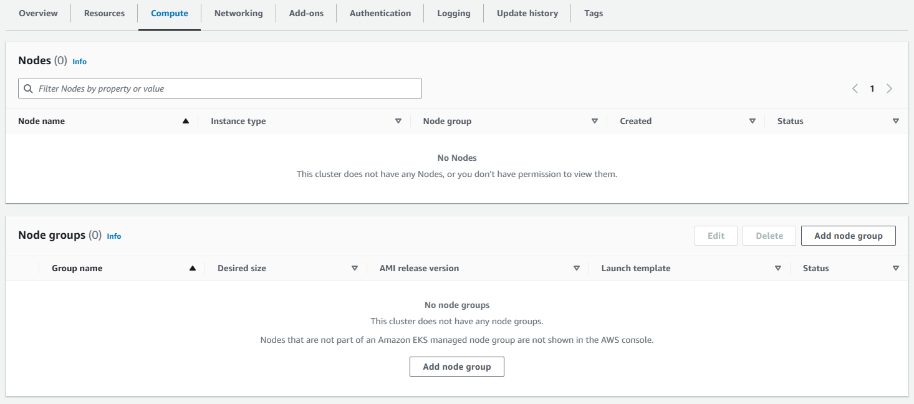
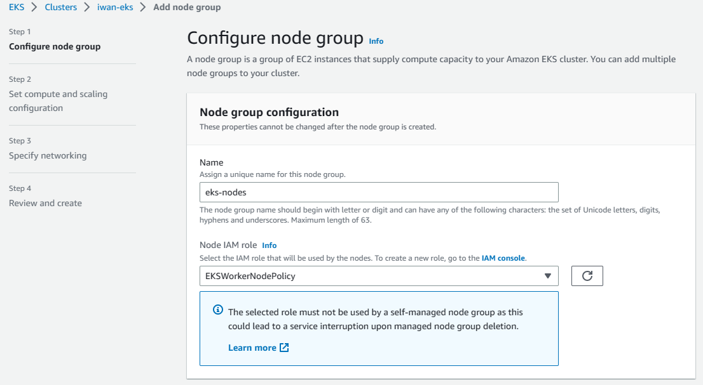
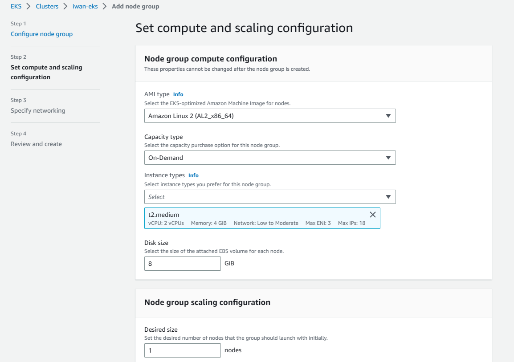
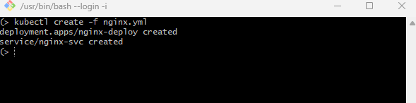
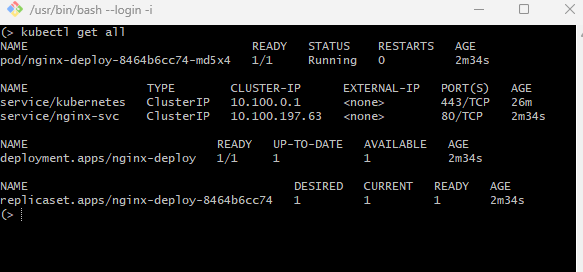
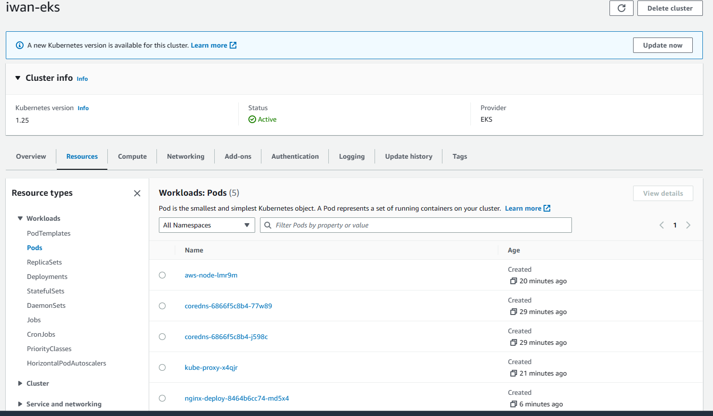
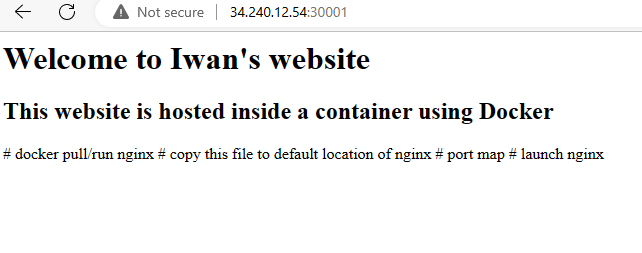

# Amazon Elastic Kubernetes Service (EKS)
Amazon EKS is a fully-managed Kubernetes service that simplifies the process of building, securing, operating, and maintaining Kubernetes clusters on AWS and on-premises data centres. EKS is certified Kubernetes-conformant, so existing applications that run on upstream Kubernetes are compatible with EKS.

EKS lets you run your Kubernetes applications on both EC2 and AWS Fargate. EKS also integrates with core AWS services such as CloudWatch, Auto Scaling Groups to provide a seamless experience for monitoring, scaling and load balancing your containerised applications.

## Create an EKS Cluster
To create a cluster in EKS, we navigate to _Clusters_ in the EKS consosle (left-hand side) and click on _Create cluster_ (which should appear if you currently have no clusters in EKS).


Alternatively you can click on _Add cluster_ then _Create_.

You will then be taken to this page where you name your cluster, select the K8s version for your cluster, and the IAM role for your cluster.


I happen to have created a role already, however if you haven't created an IAM role for your cluster you can follow the instructions to make one here: https://docs.aws.amazon.com/eks/latest/userguide/service_IAM_role.html#create-service-role

The next step is to specify the networking of your cluster i.e. select the VPC, subnets, security groups etc. Ensure that you have the appropriate networking components specified. You are also given the options to configure logging for your cluster as well as select and configure EKS add-ons for your cluster (note 3 add-ons will be installed by default).


Once we are happy with everything we create our cluster. Note that the creation of the cluster may take several minutes.

To make use of Amazon EKS we should have `kubectl` installed on our device, and also the AWS CLI. If you have none of these go to https://docs.aws.amazon.com/eks/latest/userguide/getting-started.html and follow the guide to install whatever it is you need.

Once you have everything you need, and your cluster is active, you must configure your compiter to communicate with your cluster. We do this by running the following in our terminal.


As you can see my Cluster is still being created. What we are doing here is create a `kubeconfig` file for our cluster, the settings in this file enables the kubctl CLI tool to communicate with our cluster. If we run this again once our cluster is active we should get the following output


We should also test that `kubectl` can communicate with our cluster, we can do this by running the following command.
```
kubectl get svc
```
Which should give us the following output


If you have any issues with this such as unauthorised or access denied, view https://docs.aws.amazon.com/eks/latest/userguide/troubleshooting.html#unauthorized.

Now that everything is set up for our cluster we can move on to creating a node group.

## Creating a Node Group
In EKS a node group is one or more Amazon EC2 instances that are deployed in an Amazon EC2 auto scaling group. All instances in a node group will be the same instance type, running the same AMI and use the same EKS node IAM role.

To create a node group we need our cluster status to be active, then we navigate to _Compute_ and then scroll down to _Node groups_ and click on _Add node group_.



Then we are taken to the following page to configure our node group, note that our nodes will require an IAM role, a different one to our cluster!



Also in relation to the IAM roles, these need to be roles for EC2 instances since the nodes in your node group will be EC2 instances.

In this section you are given the option to configure the node group using a launch template, you can do this or you can specify your instance configurations in the next step.



Here you can also set your auto scaling configurations for your node groups. In the next step you set networking for your nodes, you can enable SSH access, specifying a key pair and selecting a security group for your nodes.

Once you have reviewed your node group configurations and are satisfied, create your node group, the process may take several minutes. Once created there should be an auto scaling group and the desired number of EC2 instances running.

## Hosting a Web Server in our Cluster
Now that we have created our cluster and nodes, lets host an Nginx web server in our EKS cluster. In our terminal we should navigate to the location of the file we are going to run in order to create a deployment and a service.

The file I will use to launch these is `nginx.yml` which contains the following
```yml
# Deployment
apiVersion: apps/v1 # the api we want to ue for deployment 
kind: Deployment # the kind of object we want to create

metadata:
  name: nginx-deploy # naming the deployment
spec:
  selector:
    matchLabels:
      app: nginx #  look for this label to match with k8 service
  replicas: 1 # Create replicas of this with instances/pods

  template:
    metadata:
      labels:
        app: nginx # This label connects to the service
    # Lets define another container spec
    spec:
      containers:
      - name: nginx
        image: iwparry/tech201-nginx:latest 
        ports:
        - containerPort: 80
---
# Service
apiVersion: v1 # the api we want to use for service
kind: Service

metadata:
  name: nginx-svc

spec:
  type: NodePort
  ports:
  - protocol: TCP
    port: 80
    targetPort: 80
    nodePort: 30001 # range 30000-32768
  
  selector:
    app: nginx # this label connects this service to deployment
```
To create these we run the following command in our terminal
```
kubectl create -f nginx.yml
```
Which should return the following output



If we wanted to verify that everything is up and running we can run the following command in our terminal
```
kubectl get all
```
Which returns



These are all the resources we want to be running in our cluster. Alternatively, we can find these resources in the EKS console by navigating into the _Resources_ section of our cluster.



We can see our Nginx deployment pod right at the bottom of the above snippet. We can also view the services, deployments, and replica sets in the EKS console to view the same information as shown in the output to `kubectl get all`.

Now lets see if our web server is working properly, inside our cluster, navigate to _Compute_ and you should find the nodes of your node group, click on the node and you should be able to then access the EC2 instance of that node from there. Copy the public IP of you EC2 instance and search in the browser.

__IMPORTANT__ - For this to work, ensure that your security group contains the correct rules, in this case I need to ensure that my security group has a rule for NodePort (the full range or specific port should do).



There we have it! Our Nginx web server is running in our EKS cluster!