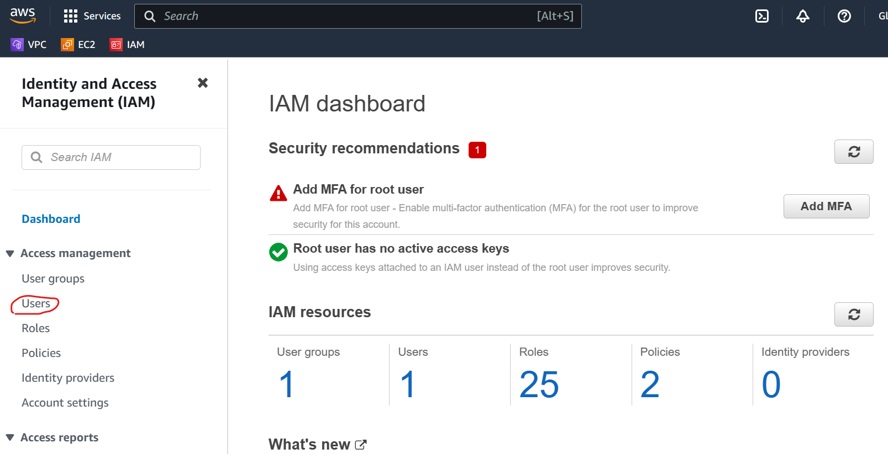
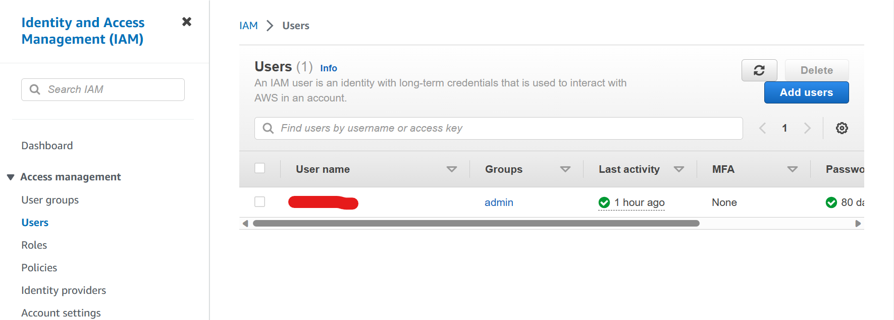
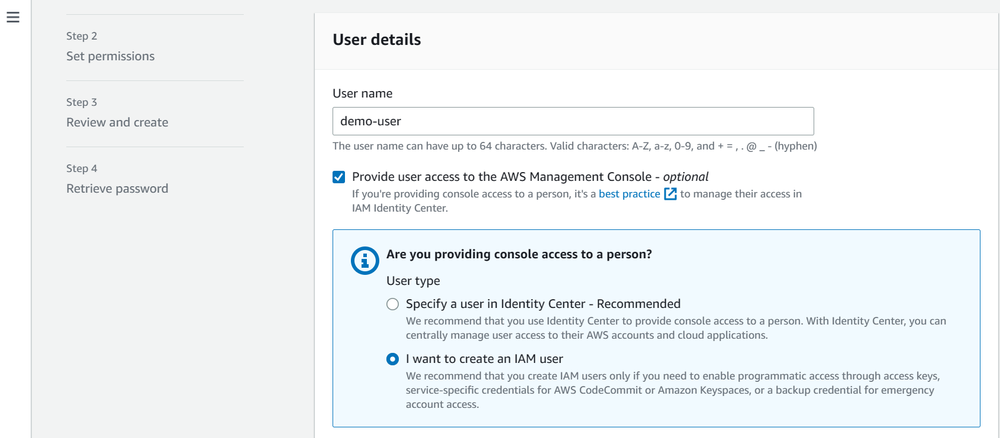
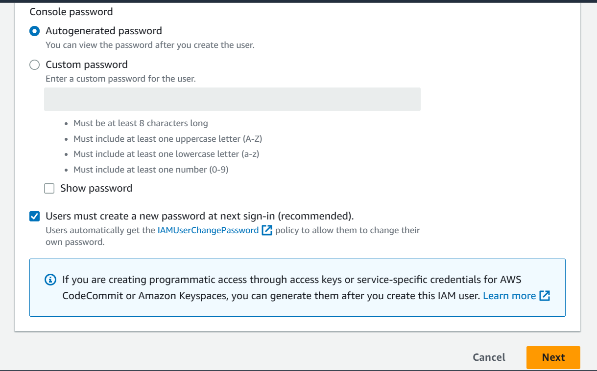
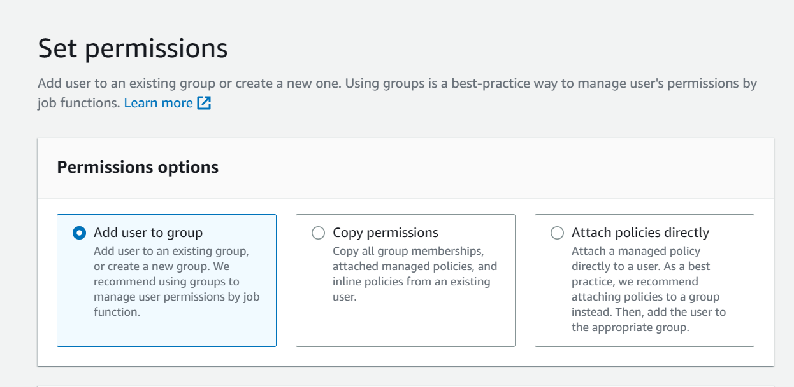
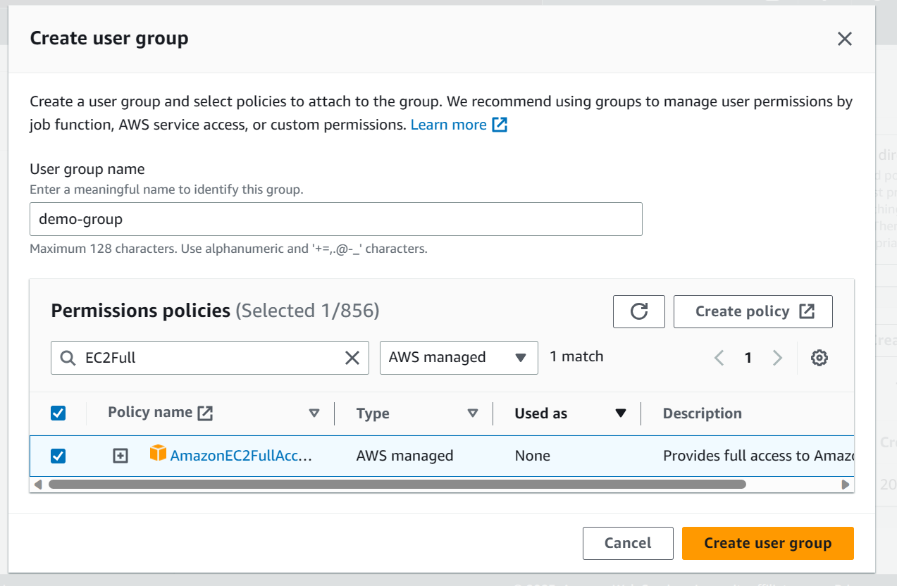
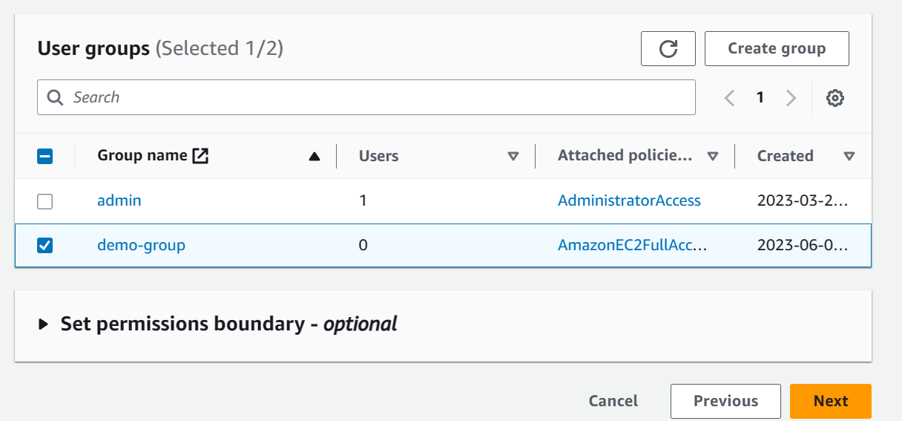
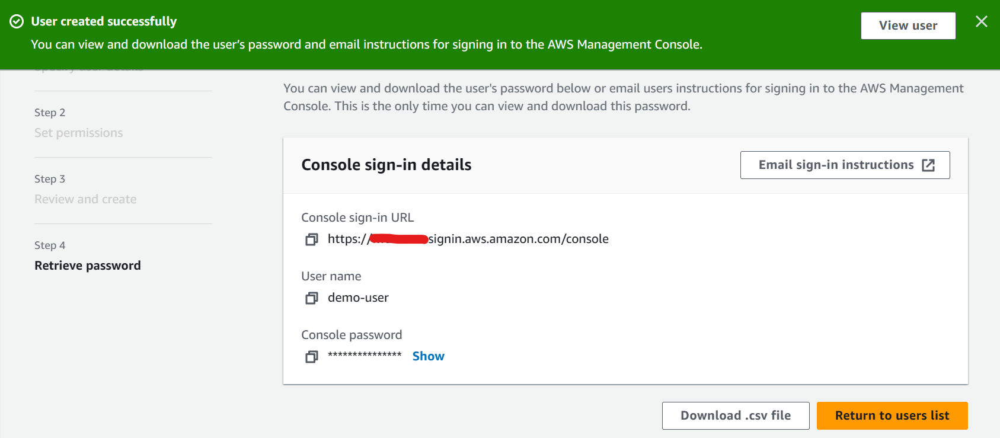
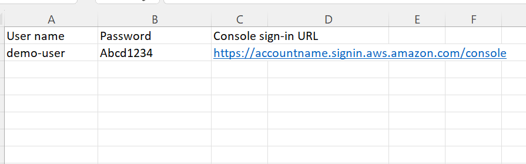
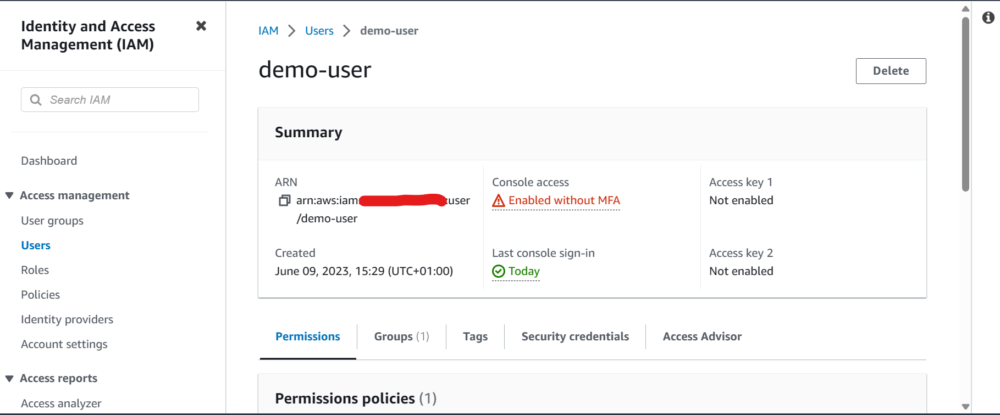

# IAM User
IAM __user__ is a user within the account (rather than a seperate account). Each user can have its own creadentials to access the AWS Management Console.

## Creating IAM users in the console
To start off go to the IAM console in AWS.

We then need to go to users, which we can access via the dropdown on the left hand side of the console.

Here we can see all the users in tha AWS account and their details. To create a new user we click on _Add users_.

Here you are asked to provide user details, and specify the type of user. For this demo I am creating a new IAM user so I will select this in the prompt. If we scroll down we have options to create a password for our user ourselves, or have an autogenerated password.

As you can see we can also set a requirement for users to create a new password upon signing in. As this was a demo I entered a custom password for the user and disabled the create password setting for the user, however it would be best to have an autogenerated password for the user and to enable the requirement for them to create a new password.

Next we set the permissions for our users, there are a number of options given to us to do this.

Generally speaking, it is recommended to add a user to a group (which should have permissions attached to it), we can add the user to an existing group, or create a new group. Another option is to copy permissions from an existing user, this doesn't add the user to an existing group should the existing user have its permissions attached via a group. And lastly we can directly attach policies that specify permissions to our user.

In this demo I'll create a group, we can do this from the current page, just scroll down to groups, and click on _Create user group_.

As you can see we are required to name the group and select the policies we want attached to the group, here I selected the policy that would grant full access to EC2.

Once the group is created, select it as shown above. We can place our user in multiple groups if we wish, note that we also have the option to limit the amount of permissions for a user via the _Set permissions boundary_. Once finished, click _Next_ which takes you to the review page for your user, and if you are happy go ahead and create the user.

The only remaining step then is to give the user their password. You can send them an email with the sign-in URL as you can see in the snippet above, and provide their password seperately, or you can download and forward the following csv file.

__NOT THE ACTUAL DETAILS__

_Remember its best practice to have the password autogenerated and to have the user change the password on signing in for the first time_.

Once created we can view the user and their details in the IAM console, details include their permissions, groups they're aligned with, security credentials, etc. And as you can see in the snippet above, we can delete the user if we wish (and we have the permissions to do so).