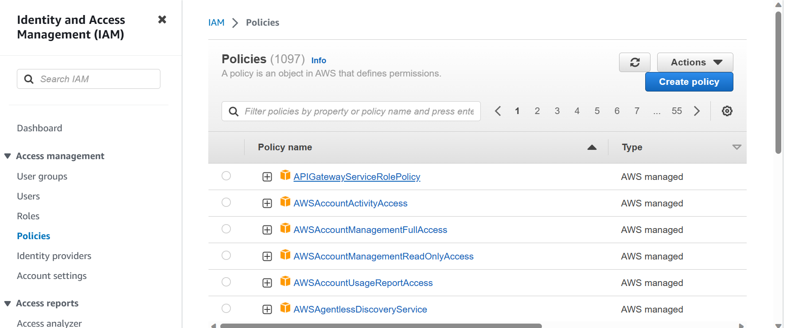
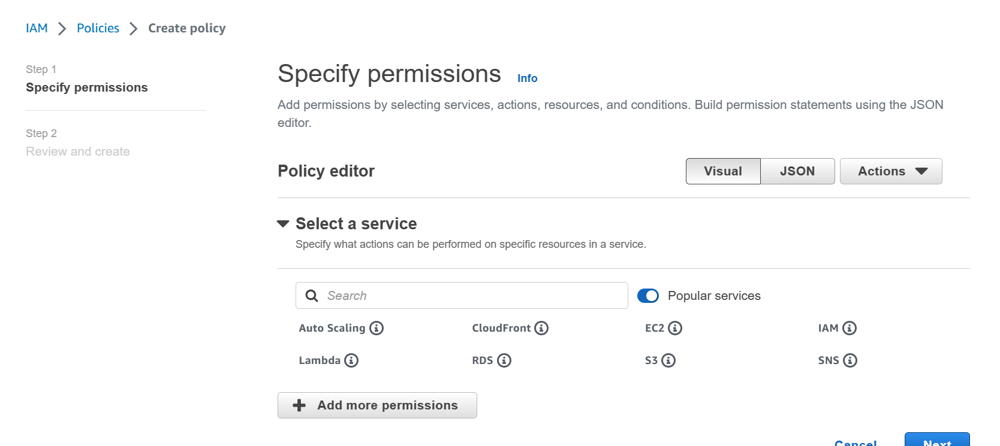
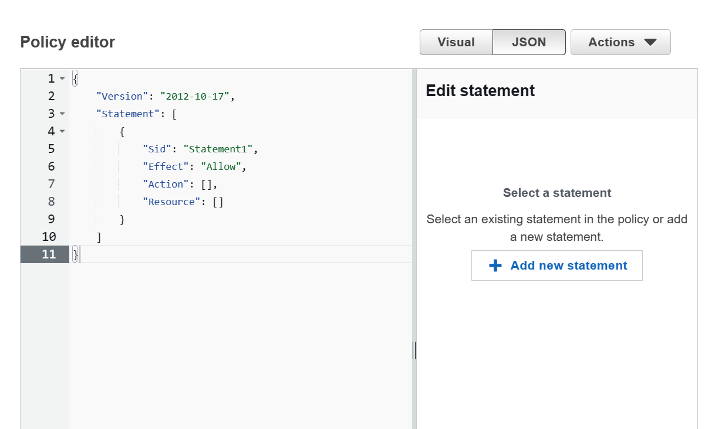
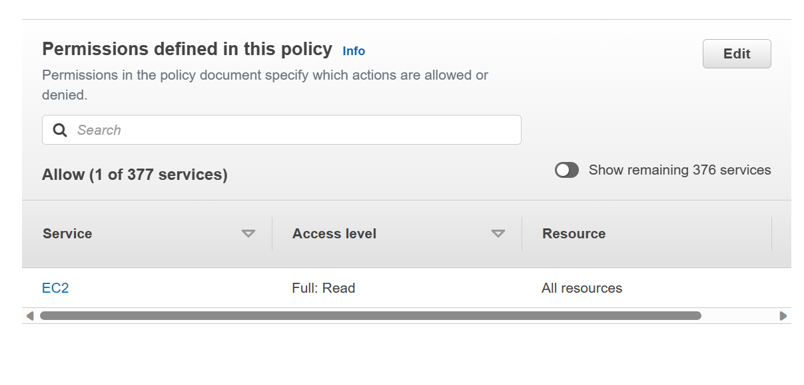

# IAM Policy
In IAM one way to grant permissions to users is through an IAM policy, which is a JSON document that specifies the permissions of the user. An IAM policy can be directly assigned to a user, or a user group in which case it is applied to all the users within that group.

## Creating an IAM Policy
To create an IAM Policy, navigate to _Policies_ which can be found on the left hand side of the IAM console.



As you can see we already have so many policies that already exist and are managed by AWS, but suppose we want to create policies of our own, here we click on _Create policy_.



Here we are able to spcify our permissions, as you can see we can select the service our permissions apply to, also we can add permissions to the policy.We are initially given a somewhat more user friendly way of creating our policy in the _Visual_ editor, but remember that policies are JSON documents, so we are also given the option to specify our permissions via a JSON editor as you can see below.



Whats useful here is the panel on the right can be used select the services and actions you would like to add to your JSON document, so it is still rather user friendly.

Once we specify permissions we then name and review the policy.



As you can see we are given a basic overview of the permissions defined in the policy. After creating the policy we can view its details in the IAM console, we can also view the policy in JSON format. Here's the demo policy in JSON:
```json
{
    "Version": "2012-10-17",
    "Statement": [
        {
            "Sid": "VisualEditor0",
            "Effect": "Allow",
            "Action": [
                "ec2:GetResourcePolicy",
                "ec2:GetDefaultCreditSpecification",
                "ec2:GetIpamResourceCidrs",
                "ec2:GetIpamPoolCidrs",
                "ec2:GetInstanceUefiData",
                "ec2:GetEbsEncryptionByDefault",
                "ec2:ExportClientVpnClientConfiguration",
                "ec2:GetCapacityReservationUsage",
                "ec2:GetHostReservationPurchasePreview",
                "ec2:GetNetworkInsightsAccessScopeAnalysisFindings",
                "ec2:GetSubnetCidrReservations",
                "ec2:GetConsoleScreenshot",
                "ec2:GetConsoleOutput",
                "ec2:ExportClientVpnClientCertificateRevocationList",
                "ec2:GetLaunchTemplateData",
                "ec2:GetSerialConsoleAccessStatus",
                "ec2:GetFlowLogsIntegrationTemplate",
                "ec2:GetEbsDefaultKmsKeyId",
                "ec2:GetIpamDiscoveredResourceCidrs",
                "ec2:GetManagedPrefixListEntries",
                "ec2:GetCoipPoolUsage",
                "ec2:GetNetworkInsightsAccessScopeContent",
                "ec2:GetReservedInstancesExchangeQuote",
                "ec2:GetAssociatedEnclaveCertificateIamRoles",
                "ec2:GetIpamAddressHistory",
                "ec2:GetPasswordData",
                "ec2:GetAssociatedIpv6PoolCidrs",
                "ec2:GetSpotPlacementScores",
                "ec2:GetManagedPrefixListAssociations",
                "ec2:GetAwsNetworkPerformanceData",
                "ec2:GetIpamDiscoveredAccounts"
            ],
            "Resource": "*"
        }
    ]
}
```
