# S3 - Simple Storage Service

Amazon S3 is used for backup and storage, disaster recovery, archive, hybrid cloud storage, application hostig, etc.

## Amazon S3 Buckets
Amazon S3 allows users to store objects in **buckets**. Buckets must have a name that is globally unique but they are defined at the region level. S3 buckets are region bound (despite the UI showing S3 as a Global service).

### Objects
These are simply files, and each object has a key, and the key is the full path, for example:
- s3://my-bucket/file.txt
- s3://my-bucket/folder1/folder2/file.txt

Buckets themselves are directories however the concept of directories doesn't exist within buckets, they are simply keys.

The max size of an object is 5TB (5000GB), if we are uploading more than 5GB we must use what is called "mulit-part upload" which is simply uploading the file in chunks i.e. if we are uploading a 50GB file then we must upload 10 parts of 5GB.

## Creating a Bucket
To do this we gi to the S3 console (search for S3 in the AWS console search bar) and click on _Create bucket_.

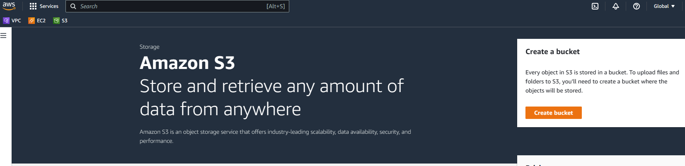

This takes us to the following page.

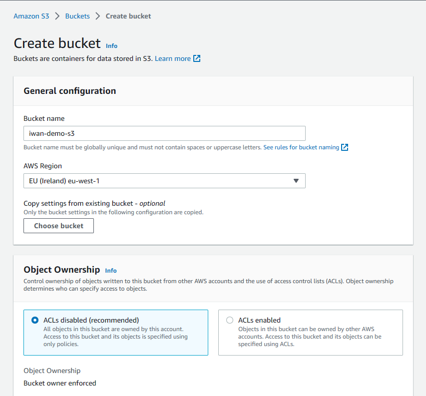

Remember that the bucket name must be globally unique, i.e. no one else has created a bucket with that name! There are several other settings but for now we will leave those at their default and create our bucket.

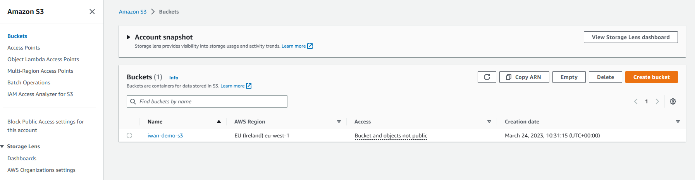

Here is our bucket created, now we would like to upload objects to our bucket (we currently have none), we select our bucket, then under _Objects_ we click on _Upload_.

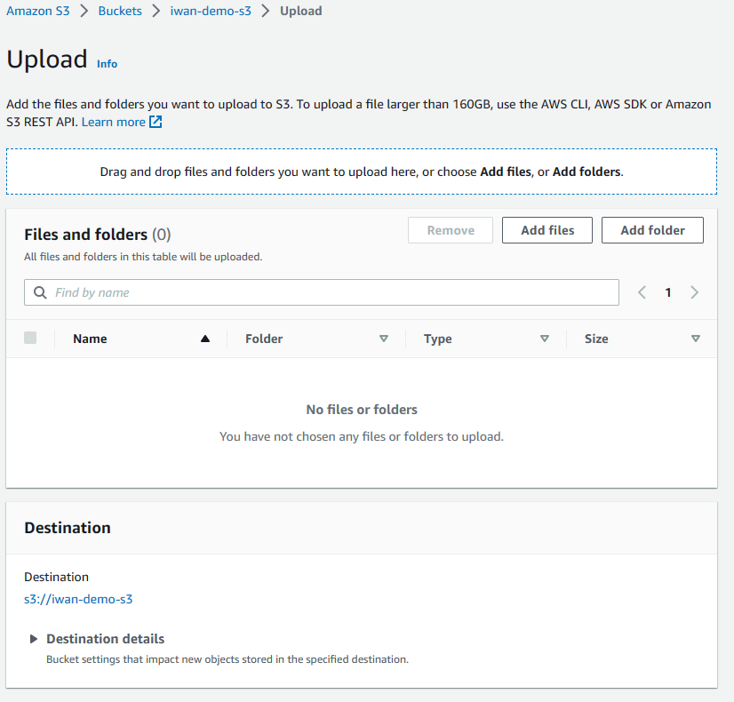

Next we click on _Add files_, select the file you want to add to your bucket, once you do this the details of your file will appear under _Files and folders_ including the name of the file, what type it is and the size. And it shows you where it will be uploaded i.e. our bucket which is **s3://iwan-demo-s3**.

Note we can also add folders to our bucket via _Add folder_.

Now we click on _Upload_.

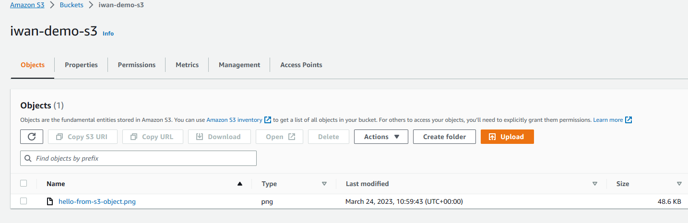

We can now see that our file appears as an object in our bucket, I chose to upload an image. Now we can click on our object and see what we can do with it.

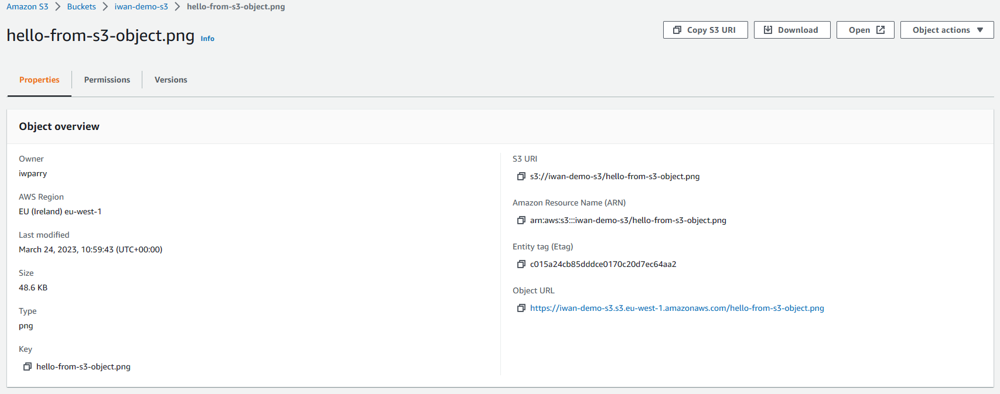

Here we are provided with an overview of the object we are currently storing in our bucket. Lets see if we can view it, we click on _Open_.

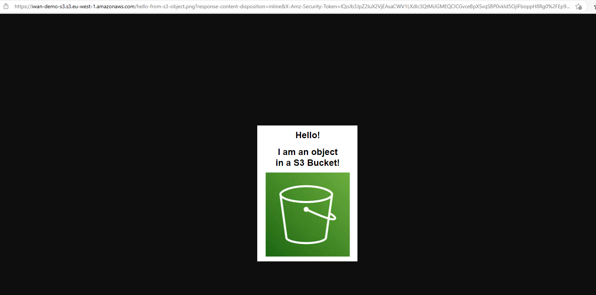

Here is our file that we are currently viewing through the internet!

You may notice that there is an object URL in the overview, if we copy that URL and try to view that in the browser we will get the following response.

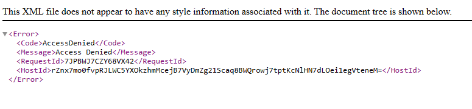

This says that I cannot access the object via public URL, the reason we were able to view the object via _Open_ was because the URL in question contains a signature that verifies my credentials.

The way to make our object accessible through its public URL is via **Bucket Policies**.

## S3 Bucket Policies
There are JSON based policies:
- Resource: buckets and objects
- Effect: Allow/Deny
- Actions: Set of API to Allow or Deny
- Principal: The account or user to apply the policy to

We can use an S3 bucket policy to grant public access to our bucket.

### Allowing public access to our bucket
To do this we navigate to the bucket we wish to make public and click on _Permissions_.

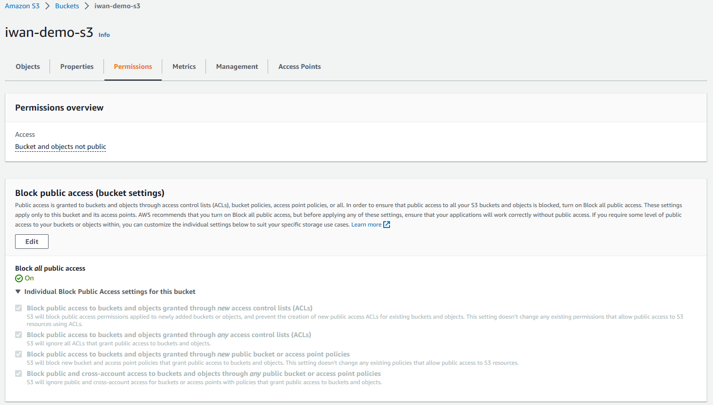

By default we've set public access to our bucket to be blocked. So first thing to do is to click on _Edit_ and then disable _Block off public access_ (please leave this enabled if you know that your bucket should never be public!). This is a dangerous action so you will be prompted by AWS to confirm that you wish to make your bucket public, so only do this if you know it is ok for your bucket to be public.

The next step is to set our bucket policy, so if you've disabled the block public access setting, this will show in your permissions overview. To set a bucket policy you need to scroll down to the bottom of the _Permissions_ section of your bucket and click _Edit_.

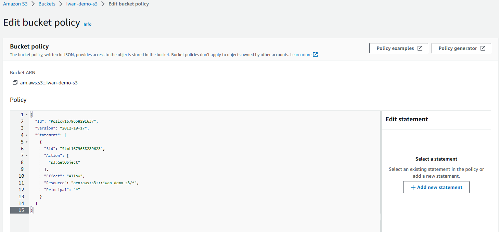

Here is a policy we've created via _Policy generator_. We select _S3 Bucket Policy_ as our policy type, we select _Allow_ as our effect and set our principal to __*__ meaning that we wish to allow anyone on our S3 to perform the action _GetObject_, and to ensure that this is performed on the correct resource (our bucket) we enter _arn:aws:s3:::iwan-demo-s3/*_ this indicates that we want this policy to apply to all objects in our bucket. Once we're done we click on _Add Statement_ and then _Generate Policy_.

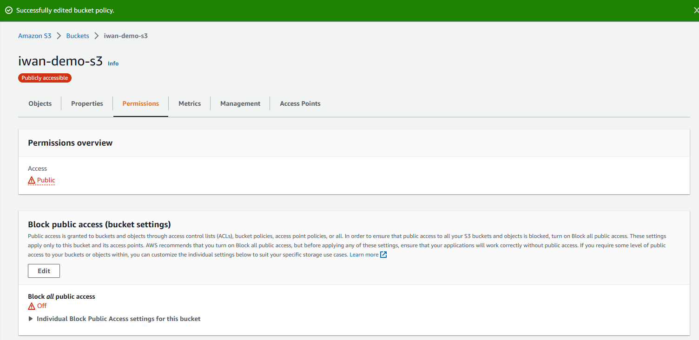

We can now see that our bucket is publicly accessible, so now if we go to the tab where we entered our object's public URL and refresh we should be able to see our image.

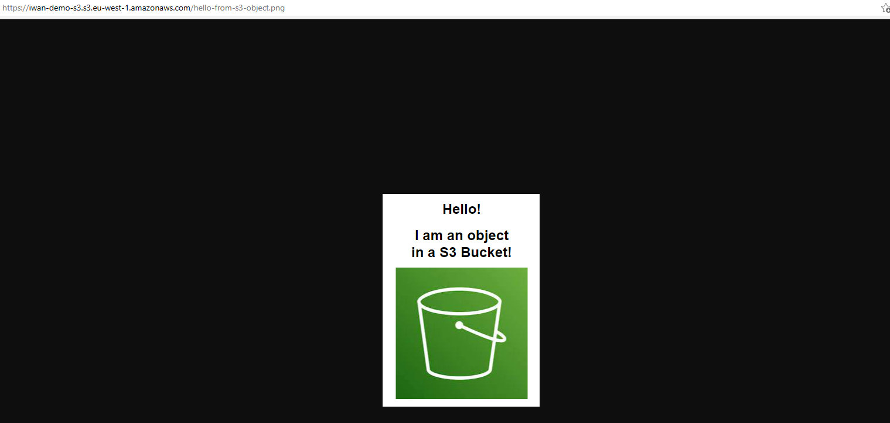

Note that the entire bucket is publicly accessible, so make sure that you do not add any sensitive data!