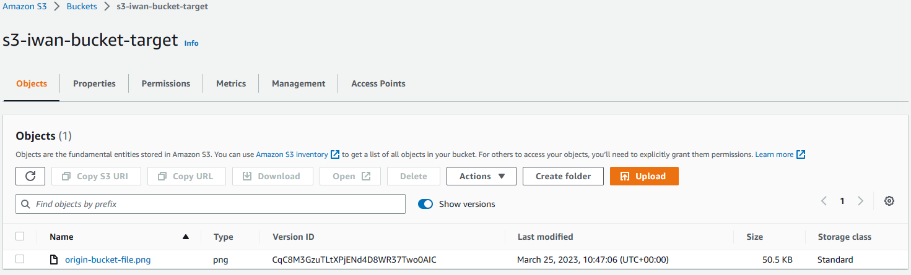
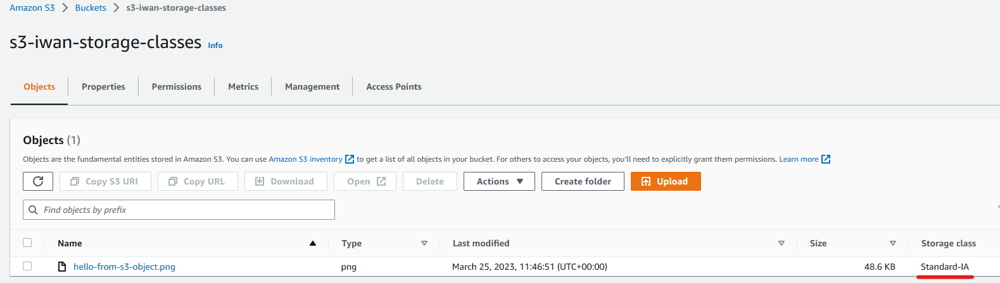

# S3 - Simple Storage Service

Amazon S3 is used for backup and storage, disaster recovery, archive, hybrid cloud storage, application hostig, etc.

## Amazon S3 Buckets
Amazon S3 allows users to store objects in **buckets**. Buckets must have a name that is globally unique but they are defined at the region level. S3 buckets are region bound (despite the UI showing S3 as a Global service).

### Objects
These are simply files, and each object has a key, and the key is the full path, for example:
- s3://my-bucket/file.txt
- s3://my-bucket/folder1/folder2/file.txt

Buckets themselves are directories however the concept of directories doesn't exist within buckets, they are simply keys.

The max size of an object is 5TB (5000GB), if we are uploading more than 5GB we must use what is called "mulit-part upload" which is simply uploading the file in chunks i.e. if we are uploading a 50GB file then we must upload 10 parts of 5GB.

## Creating a Bucket
To do this we gi to the S3 console (search for S3 in the AWS console search bar) and click on _Create bucket_.

This takes us to the following page.

Remember that the bucket name must be globally unique, i.e. no one else has created a bucket with that name! There are several other settings but for now we will leave those at their default and create our bucket.

Here is our bucket created, now we would like to upload objects to our bucket (we currently have none), we select our bucket, then under _Objects_ we click on _Upload_.

Next we click on _Add files_, select the file you want to add to your bucket, once you do this the details of your file will appear under _Files and folders_ including the name of the file, what type it is and the size. And it shows you where it will be uploaded i.e. our bucket which is **s3://iwan-demo-s3**.

Note we can also add folders to our bucket via _Add folder_.

Now we click on _Upload_.

We can now see that our file appears as an object in our bucket, I chose to upload an image. Now we can click on our object and see what we can do with it.

Here we are provided with an overview of the object we are currently storing in our bucket. Lets see if we can view it, we click on _Open_.

Here is our file that we are currently viewing through the internet!

You may notice that there is an object URL in the overview, if we copy that URL and try to view that in the browser we will get the following response.

This says that I cannot access the object via public URL, the reason we were able to view the object via _Open_ was because the URL in question contains a signature that verifies my credentials.

The way to make our object accessible through its public URL is via **Bucket Policies**.

## S3 Bucket Policies
There are JSON based policies:
- Resource: buckets and objects
- Effect: Allow/Deny
- Actions: Set of API to Allow or Deny
- Principal: The account or user to apply the policy to

We can use an S3 bucket policy to grant public access to our bucket.

### Allowing public access to our bucket
To do this we navigate to the bucket we wish to make public and click on _Permissions_.

By default we've set public access to our bucket to be blocked. So first thing to do is to click on _Edit_ and then disable _Block off public access_ (please leave this enabled if you know that your bucket should never be public!). This is a dangerous action so you will be prompted by AWS to confirm that you wish to make your bucket public, so only do this if you know it is ok for your bucket to be public.

The next step is to set our bucket policy, so if you've disabled the block public access setting, this will show in your permissions overview. To set a bucket policy you need to scroll down to the bottom of the _Permissions_ section of your bucket and click _Edit_.

Here is a policy we've created via _Policy generator_. We select _S3 Bucket Policy_ as our policy type, we select _Allow_ as our effect and set our principal to __*__ meaning that we wish to allow anyone on our S3 to perform the action _GetObject_, and to ensure that this is performed on the correct resource (our bucket) we enter _arn:aws:s3:::iwan-demo-s3/*_ this indicates that we want this policy to apply to all objects in our bucket. Once we're done we click on _Add Statement_ and then _Generate Policy_.

We can now see that our bucket is publicly accessible, so now if we go to the tab where we entered our object's public URL and refresh we should be able to see our image.

Note that the entire bucket is publicly accessible, so make sure that you do not add any sensitive data!

## Static Website Hosting
S3 can host static websites and have them accessible on the internet (make sure that the bucket policy allows piublic access).
### Making our bucket a website
I will add `index.html` to our bukcet objects (so my bucket will have 2 objects). Then go to _Properties_ then scroll down to _Static website hosting_ there we click on _Edit_ where we enable static website hosting for our bucket.

Here we are required to provide an _Index document_ which is going to be `index.html`, this is all we need to provide so we save our changes when ready.

Now we go back to _Static website hosting_ under properties and you should be able to see a _Bucket website endpoint_ as shown below.

If we copy the endpoint and open in the browser we should be able to see our static website.

## Versioning
We have created a website but we would like to be able to update it securely. In S3 we are able to version our files. To do this we will have to enable versioning in our S3 bucket.

### Enable versioning
To do this we go to the _Properties_ section of our bucket and we should straight away be able to see _Bucket Versioning_, click on _Edit_ and it will take us to the following page.

Click on _Enable_ and then _Save changes_, now any file that we overwrite will just add versions into our buckets.

So to see this in action lets say I wanted to update my static website to show the message "This is a static website hosted on AWS" (because not everyone knows what S3 is). So I change my `index.html` file and upload it to my bucket.

Then go back to _Objects_ and enable _Show versions_.

Here we can see that there are 2 versions of `index.html`, the one first uploaded (which has _null_ version id) and our updated file. And if we go to our static website endpoint we should see our update.

There is our update for us to see, but thanks to versioning we can actually roll back to our previous version! The way we do this is by clicking on the current version and click on _Delete_. You will be prompted by AWS to confirm that you wish to delete the object in question (or rather the specific version of the object).

So when we refresh the browser with our static website it will show you the first version.

Now if we go back to our objects and disable _Show versions_ and then try to delete an object (this time I'll delete the image).

We are taken to this page, but note what is going to happen is that a _delete marker_ is going to be added to the object. So unlike deleting a version, an object is not permanently deleted from our bucket. You'll see what I mean shortly, if we relaunch our website endpoint we should see this.

And if we were to try to view the image via its public URL from before, we would get a 404 error.

As mentioned a bit earlier, we haven't permanently deleted our image, if we go back to our objects inside our bucket and enable _Show versions_ once again we will be able to see that what we have actually done is add a delete marker as shown below.

As we can see the initial object is still preserved as an earlier version, with the current version being the delete marker (meaning it doesn't appear as an object in our bucket or can be viewed as before). So if we decide that we wish to restore the object what we would do is simply delete the delete marker, as we did when deleting a version of our `index.html` earlier.

Once that is done we can refresh our website and the image will reappear on our static website as well as in our bucket objects.

## Replication
Replication enables automatic, asynchronous copying of objects accross S3 buckets. Buckets that are configured for object replication can be owned by the same AWS account or by different accounts. There are two types of replication.
### Cross-Region Replication (CRR)
Cross-Region Replication, or CRR, is used to copy objects accross S3 buckets in different AWS Regions. The use cases for CRR include:
- Meet compliance requirements
- Minimise latency
- Increase operational efficiency
### Same-Region Replication (SRR)
Same-Region Replication, or SRR, is used to copy objects accross S3 buckets within the same AWS Region. The use cases for SRR include:
- Aggregate logs into a single bucket
- Configure live replication between production and test accounts
- AAbide by data sovereignty laws

### Replicating our bucket
For this to work, versioning must be enabled for both the source and destination buckets, this can be done whilst creating a bucket.

First I will create a source bucket, the bucket where the data will be copied from, and name it _s3-iwan-bucket-origin_ and I will create it in AWS Region _eu-west-1_ (Ireland) and I will enable versioning. Then I will create a destination bucket, the bucket where the data will be copied to, and name it _s3-iwan-bucket-target_, I will create this in AWS Region _eu-west-2_ (London), so this will be an example of CRR.

Next I am going to go to my source bucket and upload a file. As it currently stands this file hasn't been replicated because we haven't yet enable replication, so lets do that.

On our origin bucket we navigate to the _Management_ section, there we should be able to see _Replication rules_, under this we click on _Create replication rule_.

We are then  taken to this page, we will name our rule and leave the status on _Enabled_, we will also leave the _Source bucket_ as it is. Now if we scroll down we will be asked to select a _Destination bucket_ as seen below.

We can choose from buckets in our account, or a bucket from another account. Of course here we are selecting a bucket that is in our account, just enter the name of the bucket in _Bucket name_, note you can see a list of buckets in your account by clicking on _Browse S3_ and then selecting your target bucket.

Also note that we need an IAM role for our replication rule, if we open the _Choose IAM role_ dropdown we can create a role by selecting _Create new role_. Once that is done we can click on _Save_. Note you will be prompted asking if you wish to enable a one-time batch operations job from your replication configuration to replicate existing objects within your bucket (its actually a seperate feature to bucket replication) for the purposes of this demo I will select _No_.

So although our replication rule is created there will be nothing inside our target bucket because the replication rule will only be enabled from the moment it has been created, therefore any objects sitting in your bucket prior to the creation of teh replication rule will not be copied to the target bucket. So what I will do is actually reupload the file from before to my origin bucket, then we'll get to see if this will be copied to our target bucket.

As you can see I have reuploaded the file from earlier to my origin bucket, now lets head to our target bucket and see if the file has been copied.

Here we go! Our origin bucket file has been copied to our target bucket via CRR (because the target bucket is in _eu-west-2_ whilst our origin bucket is in _eu-west-1_). And you can verify by looking at the version ID, looking at the two snippets above you can see that our second upload to our origin bucket and the file in the target bucket have the exact same IDs.

## Storage Classes
Amazon S3 offers a range of storage classes that you can chooser from based on the data access, resiliency, and cost requirements of your workloads. S3 storage classes are purpose-built to provide the lowest cost stprage for different access patterns.

S3 as a service is incredibly durable (99.999999999% of objects in a single AZ), and this applies accross all of its storage classes. It is also designed for high avilability, with all its storage classes having over 99% availability throughout the year.

### Standard - General Purpose
- Used for frequetly accessed data
- Low latency and high throughput performance
- resilient against events that impact an entire AZ
- Use cases include: Big Data analytics, mobile & gaming applications etc.
### Standard-Infrequent Access (IA)
- For data that is less frequently accessed, but requires rapid access when needed.
- resilient in the event of one entire AZ destruction
- Use cases include Disaster Recovery, backups
### One Zone-Infrequent Access
- Lower cost alternative to Standard-IA
- Stores data in a single AWS AZ
- Data will be lost in the event of AZ destruction
- Use cases include storing secondary backup copies of on-prem data, or data you can recreate
### Glacier Instant Retrieval
- Milisecond retrieval
- Minimum storage duration of 90 days
- Great for accessing data that may be needed once a quarter
### Glacier Flexible Retrieval
- Lower cost alternative to Instant Retrieval
- Great for archive data that is accessed once or twice a year
- Has 3 types of Flexibility being Expedited (1 to 5 minutes), Standard (3 to 5 hours), Bulk (5 to 12 hours)
### Glacier Deep Archive
- Long-term storage, for data that will be retained for 7-10 years
- Retrieval types include Standard (12 hours), Bulk (48 hours)
- Minimum storage 180 days
- Lowest cost of Glacier storage classes
### Intelligent Tiering
- Small monthly monitoring and auto-tiering fee
- Moves objects automatically between Access tiers based on usage
- No retrieval charges

We can move between classes manually or by using S3 Lifecycle configurations.

### Selecting Storage class
Lets create a bucket, I will call mine _s3-iwan-storage-classes_, and I will upload a file to that bucket _hello-from-s3-object.png_. So if we select our object, under _Properties_ scroll down to _Storage class_ and select _Edit_.

Here we can view all the storage classes that AWS offers and provides information on each storage class.

I am going to select _Standard IA_ and then click _Save changes_. Now if we go back to our bucket we can see that our file now has storage class _Standard IA_.

We can manually edit the storage class of our item as we wish but we can actually autonmate moving our object between different storage classes using lifecycle rules. We do this by going to the _Management_ section of our bucket and click _Create lifecycle rule_ which is under _Lifecycle rules_ right at the top of the management section.

Here we create our rule and apply to all objects in the bucket, and our desired action is to move our objects between storage classes. If we scroll down we can then set the transitions we want for our objects.

We can then review the transition before we create our rule. 

NOTE: I didn't actually create the rule as I only wanted to demonstrate how to create a lifecycle rule.

## Encryption
There are two types of encryptions for oobjects in S3, the default is Server-Side Encryption, and the other is Client-side Encryption.

With Server-Side Encryption the server encrypts the file after receiving it.

With Client-Side Encryption the user encrypts the file before uploading it to a S3 bucket.