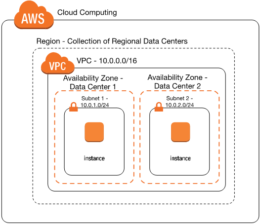

# VPC in AWS

## What is a VPC?

Amazon Virtual Private Clud (VPC) is a commercial cloud computing service that provides users a virtual private cloud, by provisioning a logically isolated section of AWS Cloud. 

## How does it help businesses?

Amazon VPC enables you to build a virtual network in the AWS cloud. This can be done without VPNs, hardwre or physical datacentres. Businesses can define their own network space and control how their network and the EC2 resources inside are exposed to the internet.

## How does it help DevOps

## Why did AWS introduce VPC?

Before Amazon introduced their VPC there was no guaranteed security. Everything done on AWS was done on their public cloud, this made many organisations hesitant to migrate to AWS due to security concerns.

## Subnets
A subnet is a range of IP addresses in your VPC. You can launch AWS resources, such as EC2 instances, into a specific subnet.

### Public and Private Subnets
A **public subnet** has a direct route to an internet gateway. Resources in a public subnet can access the public internet. A **private subnet** does not have a direct route to an internet gateway. Resources in a private subnet require a NAT device to access the public internet.

## CIDR blocks
Classless Inter-Domain Routing (CIDR) notation is a way of representing an IP address and its network mask.

## Internet Gateway
An Internet Gateway is a horizontally scaled, redundant, and highly available VPC component that allows communication between your VPC and the internet.

## Network Access Control List

# Guide to make our VPC with IG, SN and RT
1. Create a VPC
2. Create an Internet Gateway (IG)
3. Attach IG to VPC
4. Allow internet access 0.0.0.0
5. Create a public subnet
6. Associate subnet with VPC
7. Create a Route Table (RT)
8. Add rules accordingly (to RT) and attach to the public subnet
9. Edit RT - target to IG

CIDR blocks - 10.0.0.0/16

Subnets Range - 10.0.1.0/18

# Task - Deploying a 2-tier VPC
To launch an EC2 instance inside our VPC what we do is we launch a new instance 
(as we have done before, we can use an AMI). This time under "Network Settings" when we are creating our instance, we change "Network" to the desired VPC (the one we've created) and select the subnet we want to use (we should have also created this beforehand). We assigin our security group as we've done previously and then we launch the instance.
### Key objectives
First create another subnet for db (private).

Next we launch our db instance 
