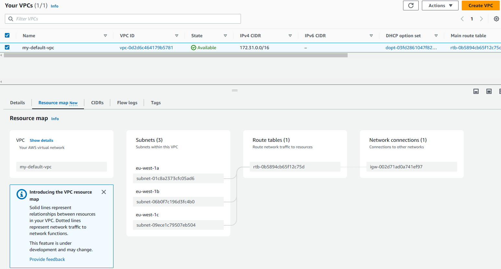

# VPC - Virtual Private Cloud
A VPC is a virtual network that closely resembles a traditional network that you'd operate in your own data centre, but with the benefits of using the scalable infrastructure of AWS. Amazon VPC enables you to launch AWS resources into a virtual network that you've defined.

AWS provides us with a default VPC, which we can view in the VPC console.

Here we can view details about our VPC such as ID, IPv4 CIDR, etc. AWS has added a new feature to the VPC console which is _Resource map_ which provides us a visualisation of our network inside our VPC.

## Subnets
A subnet is a range of IP addresses in your VPC. A subnet must reside in a single Availability Zone. After you add subnets, you can deploy AWS resources in your VPC. Simply put, subnets allows you to partition your network inside your VPC.

### Types
__Public__ - The subnet has a direct route to an internet gateway. Resources inside a public subnet can access the internet

__Private__ - The subnet does not have a direct route to an internet gateway. Resources in a private subnet requre a NAT device to access the internet.

## Routing
In AWS we can use route tables to determine where network traffic from your subnet or intenet gateway is directed.

## Internet Gateway
An Internet Gateway is a VPC component that allows communication between your VPC and the internet, it supports IPv4 and IPv6 traffic.

## Peering connections
A VPC peering connection is a networking connection between two VPCs that enables you to route traffic between them using private IPv4 addresses or IPv6 addresses. This allows resources to in either VPC to communicate with each other as if they are within the same network.

## Network Access Control List (NACL)
A firewall which controls traffic from and to subnets. With NACL you can have _ALLOW_ and _DENY_ rules, these only include IP addresses. NACL operates at the subnet level, thus applies to all instances inside the associated subnet.

## Security Groups
A firewall that controls traffic to and from and EC2 instance. Security groups only have _ALLOW_ rules that include IP addresses and other security groups.

## VPC Flow Logs
VPC Flow Logs is a feature that enables you to capture information about the IP traffic going to and from network interfaces in your VPC, so we are able to get VPC flow logs, subnet flow logs, and Elastic Network Interface flow logs. By enabling Flow Logs we are able to monitor & troubleshoot connectivity issues.

## VPC Endpoints
VPC Endpoints allow you to connect to AWS services using a private network instead of the public internet network. This in turn gives you enhanced security and lower latency when accessing AWS services. The two types of VPC Endpoints are __Gateway__ which will connect to S3 and DynamoDB, and the other is __Interface__ which can be used to connect to the rest of AWS services.

## AWS PrivateLink (VPC Endpoint Services)
AWS PrivateLink provides private connectivity between VPCs, supported AWS services, and your own on-premises networks without exposing your traffic to the public internet.
It is the most secure and scalable way to expose a service to numerous VPCs and does not require VPC peering, internet gateway, NAT, etc. In order to do this the service VPC will require a Network Load Balancer, and the customer VPC will require an Elastic Network Interface (ENI).

## Site to Site VPN
A Site to Site VPN enables you to connect your on-prem VPN to AWS, the connection will be automatically encrypted and will go over the public internet. For a Site to Site VPN to be implemented between your on-prem datacentre and your VPC you will need to use a Customer Gateway (CGW) for on-prem, and a Virtual Private Gatweay (VGW) for your VPC.
## Direct Connect (DX)
AWS Direct Connect links your internal network to an AWS Direct Connect location over a standard Ethernet fiber-optic cable, in other words DX establishes a physical connection between your on-prem datacentre and AWS. The connection is private, secure, and fast and goes over a private network. Compared to a Site-to-Site VPN it takes much longer to set up and is more expensive.

## AWS Client VPN
Allows you to securely connect to your private network in AWS and on-prem using an OpenVPN.

## Transit Gateway
This is a network transit hub that you can use to interconnect your VPCs and on-prem networks. Transit Gateway enables a peering connection bewteen numerous VPCs and on-premises systems. 