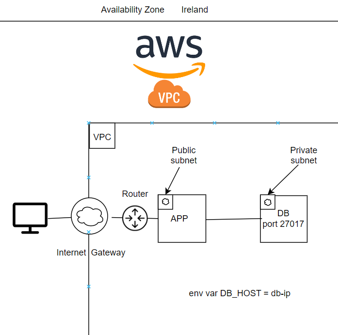
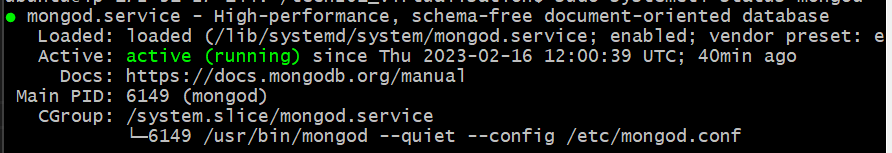

# AWS 2-Tier Architecture

A 2-tier architecture is a software architecture that consists of 2 layers, the client tier and the database tier.

## Why create a 2-tier architecture?
A 2-tier architecture provides additional to the DBMS (Database Management System) as it isn't exposed directly to the end user.

## Why should we refactor a monolithic architecture into a 2-tier architecture

One of the biggest disadvantages to a monolithic architecture is that everything is bunched into a single component, and thus a single point of failure. We need to refactor into a 2-tier architecture because monolithic systems lack the agility and flexibility that modern businesses require. Also monolithic architectures are not easily scalable.



## Task: Create a 2-tier architecture with app and DB layers

Requirements:
- App tier deployed - available on public ip on port 3000
- Create a second tier with required dependencies
  - Ubuntu 18.04
  - Mongodb installed
  - Change mongod.conf 0.0.0.0
  - Security group for our DB, port 27017
     - initially allow from anywhere
     - allow only from app instance
- Create environment variable in app instancce with DB endpoint
- Relaunch the app

To start we created a new instance for our DB that we named `tech201-iwan-db-sg` with the same AMI as we did with our app instance (ubuntu 18.04) and set security groups, first ssh as we did with app and a custom group for our DB port which is 27017.

After we set everything we needed we launched our new instance and we connected to it in the same way as we did with our app instance, through .ssh with our key (which was the same key for app).

Once we are in our instance we run the following commands:
```
sudo apt-get update -y
sudo apt-get upgrade -y
```

What we did next was migrate our provision file for DB (which we had already from the virtualisation class). There are a couple of ways to do this, we can migrate via scp as we did with our app directory, or we can clone the repository containing our provision file. Note cloning a GitHub repo is not considered best practice because if GitHub is down you will run into problems.

Once you have migrated your provision file to the instance, we can then run our provision file. First, we ensure that it has the correct permissions. We will run
```
chmod 700 db_provision.sh
```
Following which we will run the provison file, in this case we run:
```
sudo ./db_provision.sh
```
And to verify that this worked we run
```
sudo systemctl status mongod
```
If everything has been done correctly our output should be 




