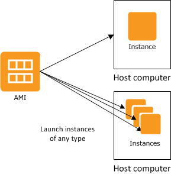

# AWS 2-Tier Architecture

A 2-tier architecture is a software architecture that consists of 2 layers, the client tier and the database tier.

## Why create a 2-tier architecture?
A 2-tier architecture provides additional to the DBMS (Database Management System) as it isn't exposed directly to the end user.

## Why should we refactor a monolithic architecture into a 2-tier architecture

One of the biggest disadvantages to a monolithic architecture is that everything is bunched into a single component, and thus a single point of failure. We need to refactor into a 2-tier architecture because monolithic systems lack the agility and flexibility that modern businesses require. Also monolithic architectures are not easily scalable.


# Task: Create a 2-tier architecture with app and DB layers

Requirements:
- App tier deployed - available on public ip on port 3000
- Create a second tier with required dependencies
  - Ubuntu 18.04
  - Mongodb installed
  - Change mongod.conf 0.0.0.0
  - Security group for our DB, port 27017
     - initially allow from anywhere
     - allow only from app instance
- Create environment variable in app instancce with DB endpoint
- Relaunch the app

To start we created a new instance for our DB that we named `tech201-iwan-db-sg` with the same AMI as we did with our app instance (ubuntu 18.04) and set security groups, first ssh as we did with app and a custom group for our DB port which is 27017.

After we set everything we needed we launched our new instance and we connected to it in the same way as we did with our app instance, through .ssh with our key (which was the same key for app).

Once we are in our instance we run the following commands:
```
sudo apt-get update -y
sudo apt-get upgrade -y
```

What we did next was migrate our provision file for DB (which we had already from the virtualisation class). There are a couple of ways to do this, we can migrate via scp as we did with our app directory, or we can clone the repository containing our provision file. Note cloning a GitHub repo is not considered best practice because if GitHub is down you will run into problems.

Once you have migrated your provision file to the instance, we can then run our provision file. First, we ensure that it has the correct permissions. We will run
```
chmod 700 db_provision.sh
```
Following which we will run the provison file, in this case we run:
```
sudo ./db_provision.sh
```
And to verify that this worked we run
```
sudo systemctl status mongod
```
If everything has been done correctly our output should be 


After this, we edit the mongodb file configuration. From the home directory (run `cd ~` if unsure) we run
```
sudo nano /etc/mongod.config
```
In the configuration file we need to navigate to this part
```
# network interfaces
net:
  port: 27017
  bindIp: 0.0.0.0
```
The we need to change the bindIp to `0.0.0.0` as we have done above to allow our app to connect to the database.

Now that everything is set on our DB instance we can now ssh into our app instance and set our environment variable.

The format for this would be
```
export DB_HOST-mongodb://<ip>:27017/posts
```
For the time being we are using our public IP that is generated by AWS when we connect to this instance. In this runthrough our public IP was `34.242.13.160` and note you should enter the IP for your DB instance in the env var,  not the app.
Note we can verify this is set via 
```
printenv DB_HOST
```
Which will return the value of our env var.

Once we have done this we can install our app, and seed the contents of our database. We do this via the following commands
```
npm install
node seed/seed.js
```
If everything has worked properly we can start up our app, and if thats running as it should we can check with our IP address.


As we can see here the app is working on the IP address that AWS generated for our instance. Note our setup involved connecting our DB instance which includes the contents of MongoDB, so we verify whether this worked aswell.
 

 There we go! We have been able to replicate what we did on our vagrant VMs on our AWS EC2 instances!

 # Creating AMI's for our EC2 Instances

 Having instances on AWS costs money, even if they are shut down, so we could terminate them but that would mean losing everything we've set in our instance, thus having to go through the entire setup all over again. What AWS gives us is the option to create an Amazon Machine Image (AMI) for our EC2 instances. 

 

 An AMI is basically a working copy of an instance that holds all the information required to launch that instance. So suppose you shut down an instance and don't restart it for a significant period of time, that will still cost money despite the instance being shut down. It is more cost effective to create a copy of that instance that can be used to relaunch the EC2 Instance later down the line should you or someone want to use it.

 In our example we first did this with our app instance. As we can see earlier, our app instance works. If we are happy with how our instance is running we can create an AMI for our specific instance.

 To satrt this we go to our instance page in  the AWS console (remember that our region should always be set to Ireland) and click on the "Actions" dropdown and then select "Images and templates" then "Create image"