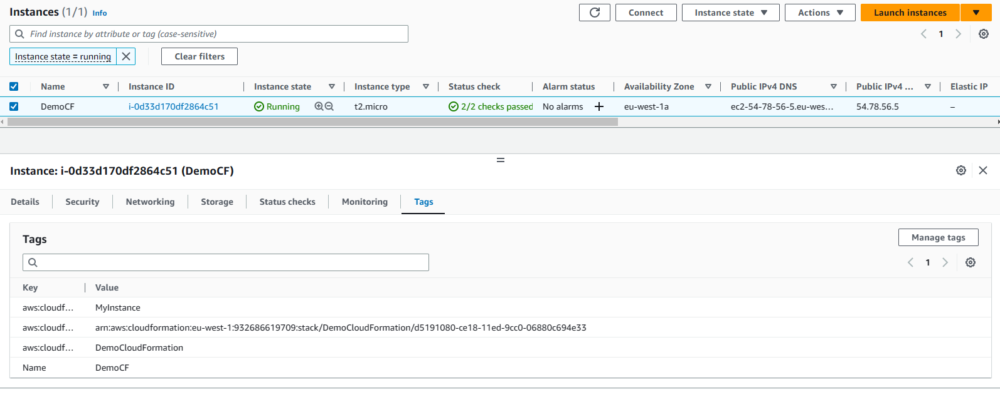

# CloudFormation
AWS CloudFormation is an infrastructure as code (IaC) service that gives developers and businesses an easy way to create a collection of related AWS and third-party resources, and provision and manage them in an orderly and predictable fashion.

## Create a CloudFormation stack
We begin by heading over to the CloudFormation service page in the AWS Console. There we should be able to create a CloudFormation stack by clicking on _Create stack_. We will then be taken to the following page.


Note that to create a CloudFormation stack we require a template. I have uploaded the following YAML file as my instance template:
```yml
---
Resources:
  MyInstance:
    Type: AWS::EC2::Instance
    Properties:
      AvailabilityZone: eu-west-1a
      ImageId: ami-00aa9d3df94c6c354
      InstanceType: t2.micro
```
To do this click on the _Upload a template file_ option that you see under _Specify template_ and then you will be asked to upload a file, in which case you select the file that you want to use. Please note that CloudFormation only works with YAML and JSON formats. 

Once you've uploaded the file you have the option to click on _View in Designer_ which will show you a graphical representation of what you are launching.


NOTE: When trying to head back to the previous page it loses all your specification, so you will have to start again from scratch, try opening the designer in a seperate tab to avoid this.

Once we are happy, we click _Next_. The next page is _Specify stack details_ all we're doing in this case is specifying the name of our stack (DemoCloudFormation for example) we can then click on next to go to step 3 which is _Configure stack options_. In step 3 we can just create a tag (key-value pair) e.g. _Name:DemoCF_, we do not need to worry about any other options for the purpose of this guide so we can just go to _Review_ to go over everything we've set and then click on _Submit_.


Here is our created stack, we are given a log of events, we can also get an overview in _Stack info_, we can see the template that we used under _Template_, and we can see the components of our stack under _Resources_. So this stack was created to launch an EC2 instance for us, so lets navigate to EC2 and see if our instance was created.



As we can see the instance we defined in our template was created, and we can verify it was created via CloudFormation by selecting the instance and looking under _Tags_.

If our stack has been completely created we can actually update it, so if you select the stack on the CloudFormation page and then click on _Update_, we will be taken to a page similar to the create stack page. So suppose I wanted to add some resources to my current stack, then I can do so by uploading a new/updated script with my desired specifications.

Here is my new YAML script:
```yml
---
Parameters:
  SecurityGroupDescription:
    Description: Security Group Description
    Type: String

Resources:
  MyInstance:
    Type: AWS::EC2::Instance
    Properties:
      AvailabilityZone: eu-west-1a
      ImageId: ami-00aa9d3df94c6c354
      InstanceType: t2.micro
      SecurityGroups:
        -  !Ref InstanceSecurityGroup
  
  # our EC2 SSH security group
  InstanceSecurityGroup:
    Type: AWS::EC2::SecurityGroup
    Properties:
      GroupDescription: Allow SSH access into EC2 instance
      SecurityGroupIngress:
        - IpProtocol: tcp
          FromPort: 22
          ToPort: 22
          CidrIp: 0.0.0.0/0
```
So to update our template we click on _Replace current tenmplate_ in the _Update stack_ page, and upload our update file in the same way as we did previously.


We can see in the designer that our instance has an elastic IP and is connected to a security group as per the YAML file above.


_NOTE: I decided to remove the ElasticIP just to simplify the update, so the file only has the security group added._

Note we added `Paramaters` to our YAML file, we are now presented with this in our stack update.


We continue to click _Next_ until we reach the last step _Review DemoCloudFormation_, and then scroll all the way to the bottom where we are presented with a _Change set preview_ section.


Here we can see the changes that are going to be made to our stack, notice that CloudFormation intends to _Add_ the elastic IP and security group, but will _Modify_ the EC2 instance, so the instance we have running already will actually be terminated and replaced by the newer instance.

Note that idempotency is a great benefit of infrastructure as code, meaning that we are able to execute our code multliple times without messing up our stack, hence why CloudFormation replaces the existing instance rather than simply launching another one on top of it. When we are satisfied we can click _Submit_ as before.

### Blocker
__HAVE RUN INTO ISSUES WITH APPLYING THE CHANGES, THERE IS SOMETHING WRONG IN MY `democf-update.yml` SPECIFICALLY WITH MY SECURITY GROUP, IT DOESN'T SEEM TO LIKE `CidrIP` FOR WHATEVER REASON__ - _Update, after referencing AWS CloudFormation documentation on resources it turns out that the correct property is `CidrIp` note these are case sensitive!_


As you can see we are shown the events of the update, and thus we can see if our update is successful or if there is an issue in which case we are able to see what is causing the issue.

Note that if a failure occurs, CloudFormation removes the failed resource and reverts to its previous state i.e. the one declared in `launch-ec2.yml`, so I can keep updating over and over until it is successful without any issues.

Upon a successful update, we should be able to see the new resourecs under the _Resources_ section, we can also see the updated template under _Template_ as well. We can then verify that our resources have been created be heading over to EC2.


Here is an ecample of a successfully updated stack, note that it has created the instance and security group we defined in our update template file and then deleted the previous running EC2 instance.

What is also useful is if we wish to delete our stack, then all associated resources will be deleted as well, meaning its easy to clean up after ourselves.

For documentation on AWS CloudFormation Resources, reference: https://docs.aws.amazon.com/AWSCloudFormation/latest/UserGuide/Welcome.html 