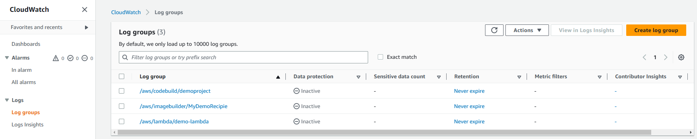
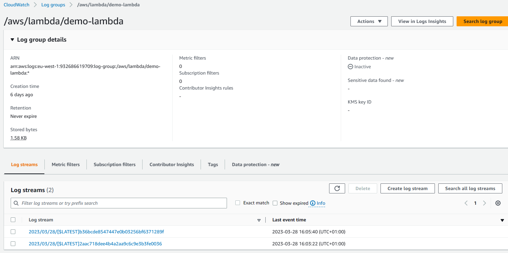
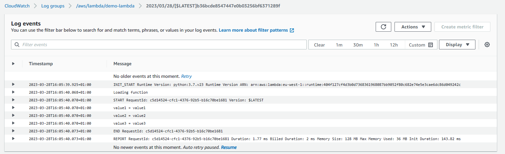

# CloudWatch
Amazon CloudWatch is a monitoring and management service that provides data and actionable insights for AWS, hybrid, and on-premises applications and infrastructure resources. You can collect and access all your performance and operational data in the form of logs and metrics from a single platform.

## Metrics
CloudWatch provides metrics for every servcie in AWS. A metric is a variable to monitor, for example CPUUtilization. CloudWatch enables you to create a metrics dashboard in order to visualize your metrics.

## Using CloudWatch to view Metrics
Lets go to CloudWatch in AWS, then on the left-hand side of the console click on _Metrics_ and _All metrics_.

Here we can see some information in relation to what we have used in AWS, I will view a metric for an EC2 instance, say CPUUtilization, that I've just created for purposes of this guide.

Here we have a list of metrics for our specific instance that we've just created, as you can see it is monitorung CPUUtilization, and we are given the information on the graph. Note we can actually view multiple metrics by selecting them.

## Alarms
Alarms are used to trigger notifications for any metric. 
### Alarms actions
__Auto Scaling__ - increase or decrease EC2 instances "desired" count

__EC2 Actions__ - stop, terminate, reboot, or recover an EC2 instance

__SNS notifications__ - send a notification into an SNS topic

Alarm States: OK, INSUFFICIENT_DATA, ALARM

## Creating an Alarm
We can create an Alarm in CloudWatch, to do so we click on _Alarms_ on the left-hand side of the console, click on _All alarms_, and then click _Create alarm_. In the first step we will be asked to select a specific metric for our alarm, we will go with CPUUtilization for our newly created EC2 instance in this case.

Here we can specify the statistic we are interested and the time period to be monitored.

Then we can define our threshold for our alarm. Then when our monitored metric is outside our threshold we can specify the action for our alarm.

So in this case we want the alarm state to be _In alarm_ and to send a notification to an SNS topic which will in turn send an email to a specified email address. Note there are other options such as Auto Scaling action, EC2 action, etc.

As we can see above, the red line on the graph represents our threshold whereas the blue line represents the actual value of the metric being monitored (As you can see in this case we are well below the threshold!). If we are satisfied with everything we can scroll down and click _Create alarm_.

We have just created an alarm through CloudWatch for our EC2 instance, but note it is possible to create an alarm for our instance directly through our EC2 console. To do this head over to insatnces in the EC2 console, then we should see the option to create an alarm for our instance as shown below.

As you can see I have already created an alarm this way. Click on the **+** in order to directly create an alarm for your instance from the EC2 console.

Here we can specify the SNS topic, alarm action, and conditions for our instance alarm.

Here we can view all of our CloudWatch alarms. 

Note there is one kind of alarm that is only available to use in AWS N.Virginia Region (us-east-1), and that is a Billing alarm.

## Logs
CloudWatch Logs enables you to centralise the logs from all your systems, applications, and AWS services you use. 

You can use Amazon CloudWatch Logs to monitor, store, and access your log files from:
- ELastic Beanstalk: collection from application
- ECS: Collection from containers
- AWS Lambda: collection from function logs
- CloudTrail based on filter
- CloudWatch log agents: on EC2 machines or on-premises servers
- Route53: Log DNS queries

### Using CloudWatch Logs
We can begin using CloudWatch Logs by clicking on _Logs_ on the left-hand side of the CloudWatch console and click on _Log groups_. Here you can see logs for AWS services you use. Note not all logs are created automatically like these below.

Here we have some log groups for some services in AWS that we've used. Note there are none for EC2 instances, that's because we would have to install log agents.

If we click on a log group we can view more information about that group, such as log streams.

A log stream is a sequence of log events that share the same source. More specifically, a log stream is generally intended to represent the sequence of events coming from the application instance or resource being monitored.

Here we can see log events, for AWS Lambda, these are created each time the code is run. 

CloudWatch Logs is useful as it allows us to troubleshoot errors in our programs by looking at log events within log groups for your applications, you can also perform log analytics, montoring, alerting, etc.