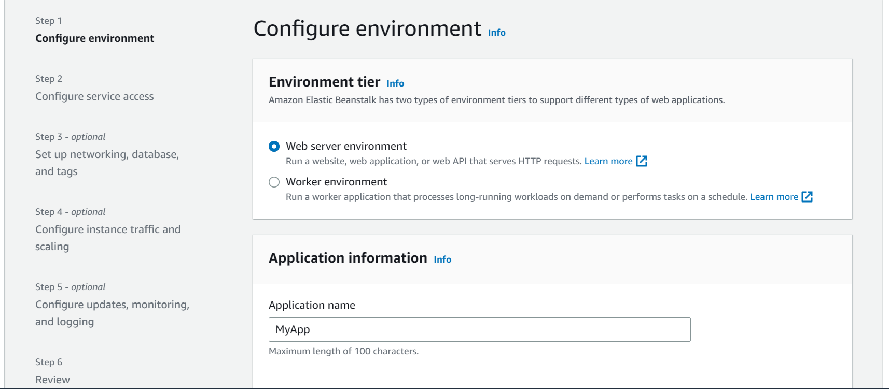
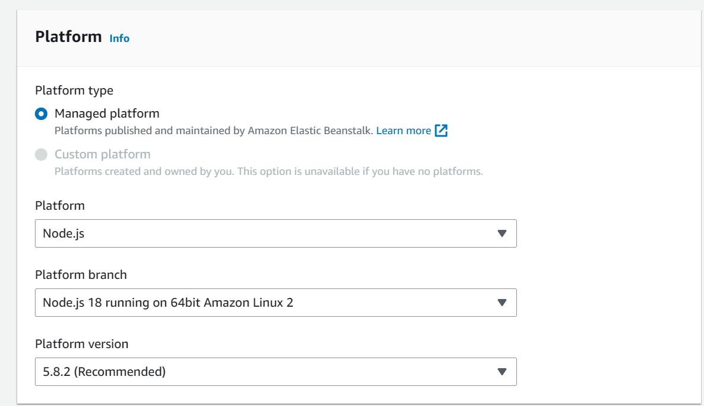
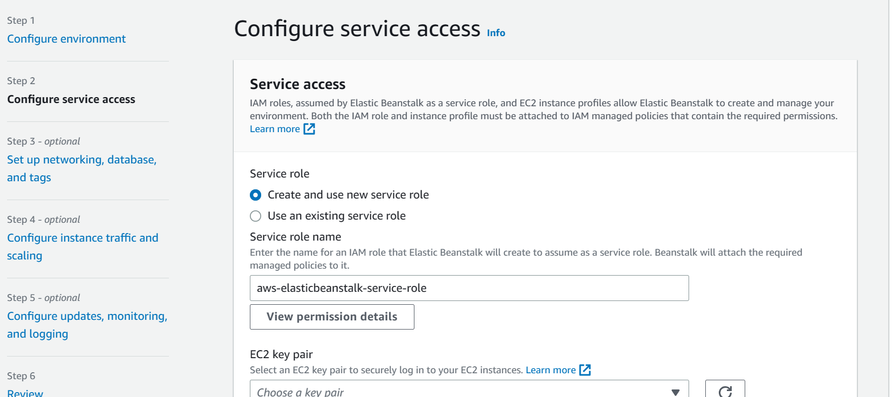
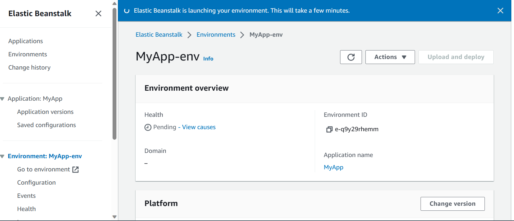

# AWS Elastic Beanstalk
Elastic Beanstalk is a Platform as a Service and a managed service in AWS that allows developers to quickly deploy and manage applications in AWS cloud without having to worry about the underlying infrastructure. With Beanstalk you simply upload your application, while it handles capacity provisioning, load balancing, scaling, and application health monitoring. Simply the application code is the only responsibility of the developer.

Elastic Beanstalk uses components such as EC2, Auto Scaling, Elastic Load Balancing, etc. Note that we still have control over the configuration of these components, its just that they all lie within Beanstalk. Elastic Beanstalk itself is free to use, however you pay for the underlying instances.

## Creating an Application with Elastic Beanstalk
To start off, go to the Elastic Beanstalk console and click on _Create application_.

We are then taken to this page where, firstly, we configure our environment and provide information on our application. The environment you will use will depend on what application you want to run, for this demo I'll select the web server environment, which is used for a web application.

If you scroll down the page you will be asked to select a platform for your application, Elastic Beanstalk supports many platforms, these include:
- Go
- Java SE
- Java with Tomcat
- Node.js
- Python
- Ruby
- Packer Builder
- Single Container Docker
- Multi-Container Docker

In this instance we will go with __Node.js__, and we'll keep the default settings for this demo.

You will also be asked to select the application code, if you have your own ready then you can upload this, but in this case we will go with the sample application which is made to match our environment. And the last customisation is your preset configuration, Beanstalk offers several of them which are suitable for different use cases, for simplicity we will go with the single instance preset.

In the next page we need to configure service access, i.e. select the IAM roles, etc. so that Beanstalk can do what it needs to do. In this instance we will create a new service role, and if we scroll down we are asked to provide an instance profile. If the instance profile is blank, head to the IAM console to create a new role for EC2, once this is done, refresh the option and it should fill out automatically. 

As the other configuration is optional we will skip to review and click on _Submit_.

Here is our Elastic Beanstalk environment.
