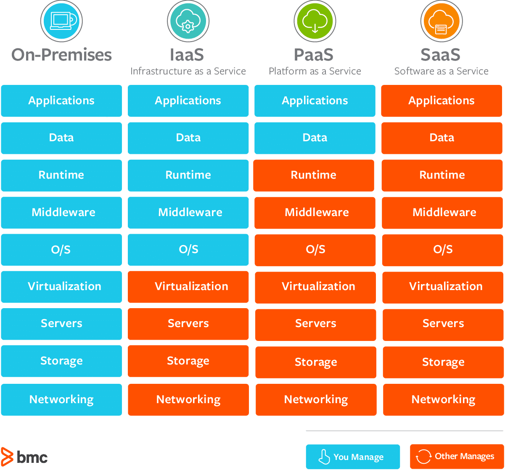

# Cloud Computing with AWS

## What is cloud computing?
Cloud computing is the on-demand delivery of compute power, database storage, applications, and other IT resources through a cloud service platform with pay-as-you-go pricing. With cloud computing you can provision exactly the right type and size of computing resources you need and they are easily accessible.

## Deployment Models of the Cloud
### Private
- Cloud services used by a single organisation, not exposed to the public.
- Complete control
- Security for sensitive applications
- Meet specific business needs
### Public
- Cloud resources are owned and operated by a third-party cloud service provider delivered over the internet
- Providers include AWS, Microsoft Azure and Google Cloud Platform
### Hybrid
- Keep some servers on premises and extend some capabilities to the cloud
- Control over sensitive aspects in your private infrastructure
- Flexibility and cost-effectiveness of the public cloud

## The Five Characteristics of Cloud Computing
1. **On-demand self service**: Users can provision resources and use them without interaction from the service provider.
2. **Broad network access**: Resources available over the network, and can be accessed by diverse client platforms.
3. **Multi-tenancy and resource pooling**: Multiple customers can share the same infrastructure with security and privacy
4. **Rapid elasticity and scalability**: Automatically and quickly acquire and dispose resources when needed and be able to quickly and easily scale based on demand.
5. **Measured service**: Usage is measured, allowing users to pay correctly for what they have used.

## Benefits of Cloud Computing
- **Trade CapEx for OpEx** - Instead of having to invest heavily in long-term investments, you can pay the cost of day-to-day operations based on your consumption of resources.
- **Benefits from massive economies of scale** - By using cloud computing, you can achieve a lower variable cost than you can get on your own. Because usage from hundreds of thousands of customers is aggregated in the cloud, providers such as AWS can achieve higher economies of scale, which translates into lower pay as-you-go prices.
- **Stop guessing capacity** - Traditionally companies would have had to invest in their infrastructure based on guessing their capacity needs. This can result in companies over or under spending, sitting on expensive idle resources or dealing with limited capacity. Cloud computing eliminates these issues, allowing you to quickly scale up and down as required.
- **Increases speed and agility** - In a cloud computing environment, new IT resources are only a click away, which means that you reduce the time to make those resources available to your developers from weeks to just minutes. This results in a dramatic increase in agility for the organization, since the cost and time it takes to experiment and develop is significantly lower.
- **No longer need to spend on running and maintaining data centres** - With Cloud computing the responsibility of running and maintaining the infrastructure falls with the cloud provider.
- **Go global in minutes** - Easily deploy your application in multiple regions around the world with just a few clicks. This means you can provide lower latency and a better experience for your customers at minimal cost.

## Problems solved by the Cloud
- **Flexibility** - Change resource types when needed
- **Cost-Effectiveness** - Pay-as-you-go for what you use
- **Scalability** - Accomodate larger loads by making hardware stronger or adding additional nodes
- **Elasticity** - Ability to scale out and scale-in when needed
- **High-availability and fault-tolerance** - Build accross data centres
- **Agility** - Rapidly develop, test, and launch software applications.

## Different Types of Cloud Computing

### Infrastructure as a Service (IaaS)
- Provide building blocks for cloud IT
- Provides networking, computers, data storage space
- Highest level of flexibility
- Easy parallel with traditional on-premises IT
### Platform as a Service (PaaS)
- Removes the need for your organisation to manage the underlying infrastructure
- Focus on the deployment and management of your applications
### Software as a Service (SaaS)
- Completed product that is run and managed by the service provider

## Capital Expenditure (CapEx) vs Operational Expenditure (OpEx)

CapEx is the cost of long-term investments, usually assest expected to last beyond the current year. Examples of CapEx are land, buildings, IT eqipment etc. These are typically paid for upfront in large sums of cash that are tied up long-term with a gradual ROI over the lifecycle of the asset. Another challenge that comes with CapEx is that ownership & responsibility is transferred to the buyer, this means that the buyer is responsible for maintaining the asset, and cannot easily get rid of the asset should it not be able to provide the expected benefits or is becoming a burden. Although the typically longer lifecycle can be a positive if the asset provides a good ROI.

OpEx is the cost of day-to-day operations. Examples of these include subscriptions, wages, marketing, property leaisng such as IT infrastructure on AWS etc. These are typically funded on a pay-as-you-go basis in relatively smaller sums of ongoing payments (monthly, etc.). OpEx allows for flexibility of investment as it does not trap the investor long-term like with CapEx, and because the responsibility of maintaining the products, lie with the vendor (a cloud provider). The ROI for OpEx costs tend to be earned in shorter billing cycles. One challenge with OpEx is predictability, because the cost is tied to usage it may be difficult for a company to predict the monthly cost for example. Of course cost based on usage can also be used as a positive.

## AWS Cloud Use Cases
- AWS enables you to build sophisticated, scalable applications
- Applicable to a diverse set of industries

Use cases include:
- Enterprise IT, Backup & Storage, Big Data Analytics
- Website Hosting, Mobile & Social Apps
- Gaming 

## Examples of companies using the cloud
### Coca-cola
Created a data lake on AWS that increased their analytics productivity by 80%.

### BMW Group
Moving to the cloud enabled BMW Group to streamline their multilingual business processes and reduce translation time by over 75%.

### Epic Games
The gaming company Epic Games went all in on the cloud to create their cutting-edge entertainment for over 350 million players.

### Netflix
Their move to the cloud enabled them to deliver their award-winning entertainment to more than 200 million members.