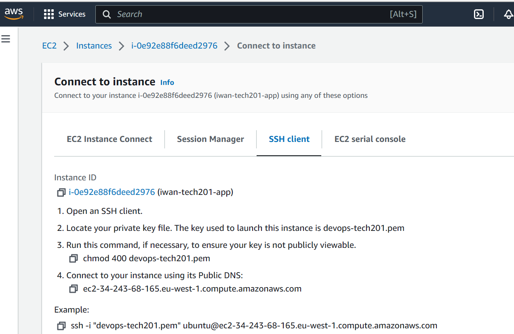
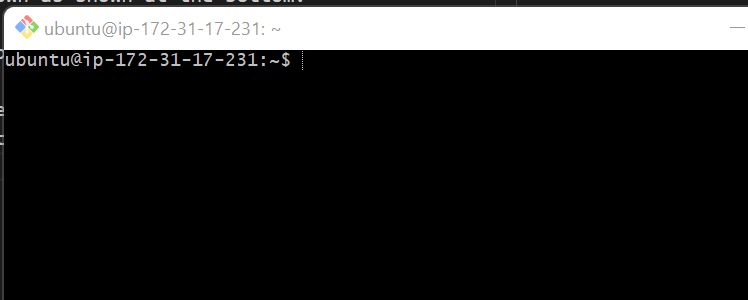

# AWS SETUP

When we login to AWS we ensure that we set our region to "Ireland", AWS may set to another region my default.

What we then do is search for EC2 in the search bar, following which we launch an instance. 

When on Launch and Instance we input a name and tags for the instance. The naming convention we use here is *name-tech201-app*.

After this we need to choose the AMI for our instance, the one we are after is ubuntu, specifically 18.04.

We need to have a public IP set for our instance.

You will then be asked for a key pair to access the security group, these keys should be provided to you (best practice to move these to your .ssh folder for security).

Leave instance type as "t2.micro"

Then in Networking change the subnet to "DevOpsStudent default 1a"

Under security group rules for our specific group we want 3 rules, one for ssh with our IP address, one for https and a custom rule for our Node.js app. On our custom rule we want to set the port range to 3000.

Once all that is done we click Launch Instance, and this should create our instance in our security group. If everything has been done alright we should see the status of our instance set to "running".

Once we are happy, we can connect to our instance by clicking on the "Actions" drop down menu at the top of the page and will take us to a "Connect to Instance Page"


We wish to connect to our instance via SSH and so we follow the instructions as above.

We open our Git Bash terminal and we copy the Public DNS in the fourth instruction paste into the example code shown as shown at the bottom.

In my example specifically it should be
```
ssh -i devops-tech201.pem ubuntu@ec2-34-243-68-165.eu-west-1.compute.amazonaws.com
```

When we run this command we should see


Now we know that we are logged into our instance we run a series of commands.

First we update and 
```
sudo apt-get update
sudo apt-get upgrade
```
Then we install Nginx
```
sudo apt-get install nginx
```
Once that is done, we start/enable Nginx
```
sudo systemctl enable nginx
```
Nginx should now be working on our public IP on AWS which in this case is 34.243.68.165.

## Evening task

We were tasked with migrating our app folder from our device to our instance on the cloud and to get the app working for us as done previously in our virtrualisation class.

### Objectives
- migrate app folder with provision.sh
- have the reverse proxy working
- install the required dependencies
- navigate to our app folder
- install the app
- start the app

#### Migrate app folder to AWS from our local device
To do this we open our terminal and navigate to our `.ssh` file. In order to migrate our folder we will need to run the following command:
```
scp -i devops-tech201.pm -r app/ ubuntu@ec2-34-243-68-165.eu-west-1.compute.amazonaws.com:/home/ubuntu
```
This will copy our app folder from our local device to our instance on AWS.

Once this is done we can login to our AWS instance.

Note that we can also use the same command to migrate a provisioning file, minus the '-r' after the key because its a file not a directory. And we can activate the script via this command:
```
sudo ./provison.sh
```
Note to give permissions via 
```
chmod 700 provision.sh
```
